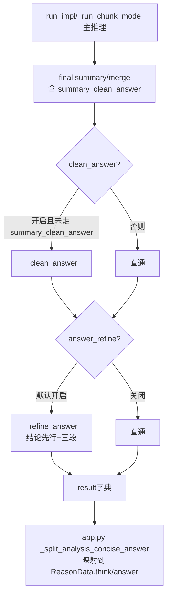

## 设计要点（依据已确认的 Q1/Q2）

- **触发位置**：`reasoner/v2/agent_graph.AgentGraph.run()` 流水线最末一步（`_clean_answer` 之后、返回 `result` 之前）。覆盖 standard / retrieval / chunk 三种模式。
- **输入**：仅取最终 answer 部分（兼容 think_mode 下的 `{think, answer}` JSON / `<think>/<answer>` HTML / 纯文本三种形态）+ 用户问题。**不输入** think 字段（与你的描述一致）。
- **LLM 输出**：纯文本（结论先行 + 核心证据 / 因果逻辑 / 注意事项三段）。不走 JSON/HTML 双格式兜底。
- **写回策略**（对应 Q1 的回答）：
  - `think_mode=True` 时：把 **refine 之前的原 answer** 写到响应 `think` 字段，把 **refine 结果** 写到响应 `answer` 字段；通过返回 `{"think": <原answer>, "answer": <精简版>}` JSON 让 `app.py._split_analysis_concise_answer` 自然映射。
  - `think_mode=False` 时：直接用 refine 结果替换 `result["answer"]`（纯文本，原行为不变）。
- **正交性**：与 `cleanAnswer` / `summaryCleanAnswer` / `thinkMode` / `lastThink` 完全正交；放在 `_clean_answer` 之后追加，不互斥。
- **失败兜底**：LLM 调用抛异常时打 ERROR 日志、原样返回前序 answer（保证额外节点不会拖垮主流程）。
- **CSV / API 自动生效**：因为只动 `result["answer"]`，`engine.py` 的"答案"列与 `app.py` 的响应字段会自动接收新值，无需改 engine/输出层。

## 涉及文件与改动

### 1. [reasoner/v2/prompts.py](reasoner/v2/prompts.py)
新增两个常量（参考现有 `CLEAN_ANSWER_PROMPT` 与 `_KNOWLEDGE_INTERNALIZATION_BLOCK` 的风格）：

- `ANSWER_REFINE_SYSTEM_PROMPT`：约束身份（财税咨询客服）、"不要过度精简，避免丢失关键因果与限制条件"、复用知识内化禁词清单（避免再次冒出"原文/依据/综合"等开卷词汇）。
- `ANSWER_REFINE_PROMPT`：含 `{question}` / `{raw_answer}` 两个占位符；输出结构要求：
  - 第一行/首段：直接结论（一句话回答问题，必要时含"是/否/分情况"）；
  - 下方按需出现 `## 核心证据` / `## 因果逻辑` / `## 注意事项` 三段（"按需"指证据/注意事项确实存在才写，不强行凑齐）；
  - 不要 JSON / HTML 包装，纯文本。

### 2. [reasoner/v2/agent_graph.py](reasoner/v2/agent_graph.py)

a. `__init__` 新增字段：

```python
self.answer_refine = bool(answer_refine)
```

并在签名末尾加 `answer_refine: bool = False`。

b. 新增 helper：

```python
def _extract_user_facing_answer(self, raw: str) -> str:
    """从 raw answer 抽取面向用户的纯文本：
    1) JSON {think, answer} → answer 字段（复用 _extract_answer_from_think_answer_json）
    2) HTML <think>/<answer> → answer 部分（复用 _parse_think_answer_html）
    3) 纯文本 → 原样
    """
```

c. 新增 `_refine_answer(self, raw_answer: str) -> str`，逻辑：
- 抽取 user-facing answer；
- 用 `step_scope("answer_refine", prompt_vars={"user": "ANSWER_REFINE_PROMPT", "system": "ANSWER_REFINE_SYSTEM_PROMPT"})` + `chat(..., enable_thinking=self.last_think)` 调用；
- `_postprocess_final_chat` 剥 think 前缀；
- 返回值：
  - `self.think_mode=True` → `json.dumps({"think": <抽取出的原 answer>, "answer": <refine 结果>}, ensure_ascii=False)`
  - 否则 → 直接返回 refine 结果。
- 任何异常 → `logger.error` 后 `return raw_answer`。

d. 在 `_run_impl` 与 `_run_chunk_mode` 末尾插入：

```python
if self.answer_refine:
    answer = self._refine_answer(answer)
```

位置紧跟现有 `if self.summary_clean_answer: ... elif self.clean_answer: answer = self._clean_answer(answer)` 之后、`trace_log = ...` 之前。

### 3. [reasoner/v2/engine.py](reasoner/v2/engine.py)
- `_process_single_question` / `run_single_question` / `_run_sequential` / `_run_parallel` / `run_reasoning` 五个函数签名末尾追加 `answer_refine: bool = False` 形参，并逐层透传到 `AgentGraph(...)` 构造与下游函数（与现有 `pure_model_result` 等参数完全相同的传递模式）。

### 4. [main.py](main.py)
- `reason_parser` 新增：

```python
reason_parser.add_argument(
    "--answer-refine", action=argparse.BooleanOptionalAction, default=True,
    help="启用答案精简（仅 v1/v2 生效）：在整体推理流程最末一步对最终 answer 做"
         "「结论先行 + 核心证据/因果逻辑/注意事项」结构化精简。"
         "thinkMode=True 时，原完整 answer 会迁移到 think 字段，精简结果写入 answer。"
         "默认开启；可显式 --no-answer-refine 关闭"
)
```
- `cmd_reason`：`common_kwargs["answer_refine"] = args.answer_refine`（在 `if version in ("v1","v2"):` 分支内，保持与 `pure_model_result` 等同位置）；并补一行 `if version not in ("v1","v2") and args.answer_refine: print("警告：--answer-refine 仅在 --version v1/v2 下生效，本次将被忽略")`。

### 5. [app.py](app.py)
- `ReasonRequest` 新增 Field：

```python
answerRefine: bool = Field(
    default=True,
    description="启用答案精简：在整体推理流程最末一步对最终 answer 做"
                "「结论先行 + 核心证据/因果逻辑/注意事项」结构化精简。"
                "thinkMode=True 时，原完整 answer 会迁移到响应 think 字段，"
                "精简结果写入响应 answer 字段；thinkMode=False 时直接覆盖 answer 字段。"
                "仅在 version=v1/v2 下生效",
)
```

- `_run_reasoning` 形参追加 `answer_refine: bool = False`，在 `if version in ("v1","v2"):` 块里加 `extra_kwargs["answer_refine"] = answer_refine`，否则按现有惯例打 warning。
- `_reason_executor` 调用 `_run_reasoning(...)` 时追加 `answer_refine=request_payload.get("answerRefine", True)`。
- `session_meta` 增加 `"answerRefine": request_payload.get("answerRefine")`，对齐 verbose 日志的元数据。

## 调用关系示意



## 不做的事

- 不在 `clean_answer` / `_chat_final_with_format_retry` 内部改造，保持原有 final summary 链路稳定。
- 不引入新的 JSON/HTML 双格式兜底（refine 输出仅为纯文本）。
- 不动 `engine.py` 的 CSV 列结构（CSV 的"答案"列仍是 `result["answer"]`，自动接收 refine 结果）。
- 不修改 v0/v1 的 agent_graph（仅 v2 落地；v1 复用与否后续按需求再说）。
