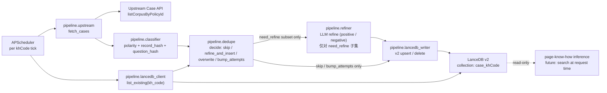
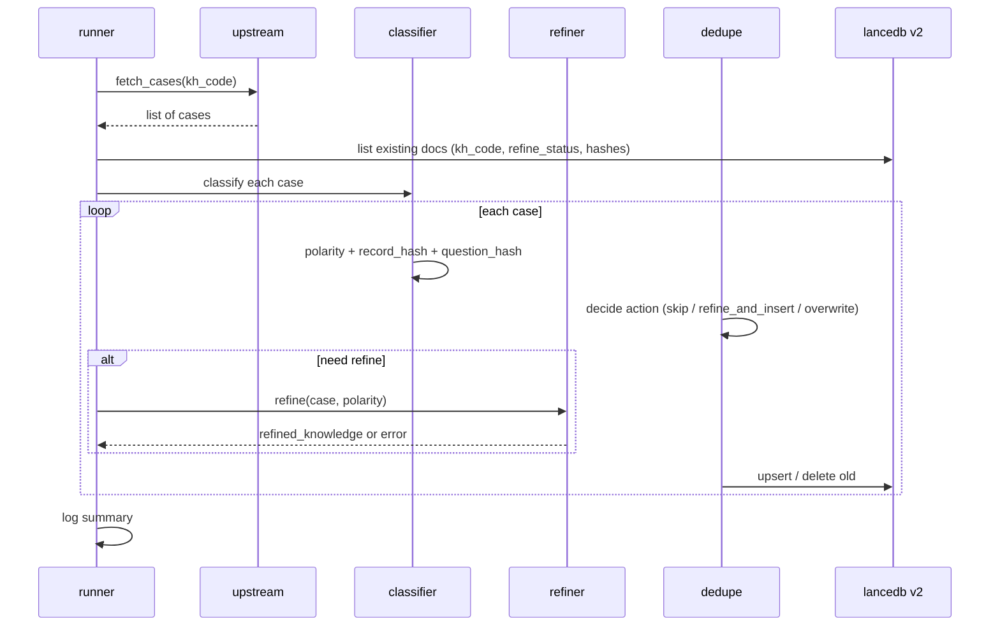

# Case Refinery Service 实现计划

## 1. 目标与边界

- **职责**：把上游线上 case 回流接口（`POST /kg-platform/api/kh/listCorpusByPolicyId`，参数视作 `khCode`，返回体不变）拉到的 case，按正/负样本分别 LLM 提炼成"场景化财税案例知识"，写入 LanceDB v2 collection `case_{khCode}`。
- **服务形态**：独立 FastAPI 进程，APScheduler 常驻调度。
- **代码边界**：
  - 不 import 主仓 `page-know-how` 任何业务模块（`inference/`、`reasoner/`、`extractor/`）
  - 需要的通用工具（`llm/client.py` + `utils/helpers.py::retry`）以"复制 + 精简"方式放进 `case_refinery/vendor/`，独立演化
  - 仅通过 HTTP 与 LanceDB v2 通信（参考 [docs/lancedb_v2_api.md](docs/lancedb_v2_api.md)）
- **与主仓关系**：主仓 `app.py`、`inference/` 后续在推理流程中通过 LanceDB v2 `search` 读 `case_{khCode}` collection，**不反向调用本服务**。

## 2. 数据流总览

设计原则：**refine（LLM 调用）是最贵的一步，必须放在 dedupe 之后**，只对真正需要写入或覆盖的子集才触发 LLM，跳过的 case 一次 token 都不烧。




## 3. 目录结构

```
case_refinery/
├── README.md                       # 服务定位、与主仓边界、本地启动方法
├── requirements.txt                # fastapi / uvicorn / apscheduler / httpx / requests
├── config.py                       # 全部配置（env 优先）
├── app.py                          # FastAPI 入口 + lifespan 启停 APScheduler
├── scheduler.py                    # APScheduler 作业注册
├── api/
│   ├── __init__.py
│   └── routes.py                   # /healthz /status /trigger /trigger/{khCode}
├── pipeline/
│   ├── __init__.py
│   ├── upstream.py                 # 上游 case 接口封装
│   ├── classifier.py               # case_polarity 判定 + record_hash + question_hash
│   ├── prompts.py                  # positive / negative refine prompt 模板
│   ├── refiner.py                  # LLM 调用 + 解析 + 异常降级
│   ├── lancedb_client.py           # v2 HTTP 客户端（upsert / list / delete）
│   ├── dedupe.py                   # 去重 + 覆盖决策表
│   └── runner.py                   # 一次完整任务 orchestration
├── vendor/                         # 从主仓复制的依赖
│   ├── __init__.py
│   ├── llm_client.py               # 复制自 page-know-how/llm/client.py，剥离 verbose_logger
│   └── utils_helpers.py            # 复制自 utils/helpers.py 的 retry 装饰器
└── tests/
    ├── __init__.py
    ├── conftest.py
    ├── test_classifier.py
    ├── test_dedupe.py
    └── test_runner_mock.py
```

## 4. LanceDB Document Schema

每条 case → 一个 document：

```python
{
  "document_id": "<uuid4 hex>",        # 仅作主键，不带业务语义
  "content": "<questionContent>",       # 检索面用，仅 question 文本
  "content_tokenized": "",              # 留空：服务端 fallback 简单分词
  "vector": [],                         # 留空：服务端基于 content 自动 embed
  "metadata": {
    "kh_code": "...",
    "source": "case_refinery",

    # 上游 5 字段完整保留
    "question_content": "...",
    "original_answer": "...",
    "original_thinking": "...",
    "answer_content": "...",
    "thinking": "...",

    # refine 产物
    "refined_knowledge": "...",         # 成功时为提炼后的知识；raw_fallback 时为空串
    "refine_status": "refined",         # refined | raw_fallback
    "refine_attempts": 1,
    "refined_at": 1716700000000,        # 0 = 未成功

    # 标签
    "case_polarity": "positive",        # positive | negative
    "expert_revised": false,

    # 调度 + 去重
    "record_hash": "<sha256 of 5 fields>",
    "question_hash": "<sha256 of questionContent>",  # 同 question 覆盖用
    "ingest_ts": 1716700000000,
    "schema_version": 1,
  }
}
```

`record_hash` / `question_hash` / `refine_status` / `case_polarity` / `kh_code` 是关键过滤字段（v2 会自动扁平化为 `md_*` 列并尝试建标量索引）。`question_hash` 用 hash 而非原文，避免长 question 比对开销。

## 5. 单轮任务流程（per khCode）




伪代码（核心，放在 [case_refinery/pipeline/runner.py](case_refinery/pipeline/runner.py)）：

```python
async def run_once(kh_code: str) -> RunSummary:
    cases = await upstream.fetch_cases(kh_code)
    if not cases:
        return RunSummary(skipped="upstream empty, no-op")

    existing = await lancedb.list_existing(kh_code)
    # existing: dict[record_hash] -> {doc_id, refine_status, question_hash}
    # question_index: dict[question_hash] -> list of doc_id

    for case in cases:
        polarity = classifier.classify(case)
        record_hash = classifier.record_hash(case)
        question_hash = classifier.question_hash(case)

        decision = dedupe.decide(
            record_hash, question_hash, polarity, existing,
        )
        if decision.skip:
            continue

        refined = None
        if decision.need_refine:
            refined = await refiner.refine(case, polarity)

        await lancedb.apply(decision, case, polarity, refined,
                            record_hash, question_hash)
```

## 6. 去重 + 覆盖决策表（[case_refinery/pipeline/dedupe.py](case_refinery/pipeline/dedupe.py)）


| 上游 case | 库内同 record_hash 存在 | 已存 refine_status | 本轮 refine 结果 | 动作                                     |
| ------- | ------------------ | ---------------- | ------------ | -------------------------------------- |
| 任意      | 否                  | —                | 成功           | append (refined) + 清同 question 旧版      |
| 任意      | 否                  | —                | 失败           | append (raw_fallback) + 清同 question 旧版 |
| 任意      | 是                  | refined          | —            | skip                                   |
| 任意      | 是                  | raw_fallback     | 成功           | delete 旧 + append (refined)            |
| 任意      | 是                  | raw_fallback     | 失败           | refine_attempts += 1（仅元数据更新）           |


补充规则：

- **同 question 不同 record_hash 覆盖**：本轮成功入库新版后，扫 `question_hash` 索引，删除同 `kh_code` 下同 `question_hash` 但不同 `record_hash` 的所有旧 doc（专家修订只保留最新）。
- **失踪 case（上游未返回）**：不做任何处理，保留在库内（用户确认）。
- **空批兜底**：本轮上游返回 0 条 → 整轮 no-op，绝不触发任何删除。

## 7. Refine Prompt 策略（[case_refinery/pipeline/prompts.py](case_refinery/pipeline/prompts.py)）

两套独立 prompt，MVP 先写直观版本，后续可灰度迭代：

**Positive case prompt**

- 输入：`questionContent` + `answerContent`（=`originalAnswer`）+ `thinking`
- 输出要求：场景化财税案例知识，建议结构
  - 业务场景描述（脱敏抽象）
  - 关键判定要素
  - 适用政策/原则
  - 结论与会计/税务处理
- 用途：作为推理增强证据直接召回

**Negative case prompt**

- 输入：`questionContent` + `originalAnswer` + `answerContent` + `originalThinking` + `thinking`
- 输出要求：以"正向推导"形态给出案例知识，重点：
  - 关键判定差异点（专家修正了什么）
  - 正确推导路径（正向重构，不暴露"原回答是错的"的负面措辞）
  - 适用政策/原则
- 用途：让后续推理具备"正确范式"参考，规避同类错误

异常处理：

- LLM 调用失败 / 输出不可解析 → `refine_status="raw_fallback"`，`refined_knowledge=""`，按决策表逻辑允许下轮重试
- LLM 调用走 `vendor/llm_client.py` 复制版（带 `retry` 装饰器，默认 3 次重试）

## 8. 各模块关键签名

[case_refinery/pipeline/upstream.py](case_refinery/pipeline/upstream.py)

```python
async def fetch_cases(kh_code: str) -> list[CaseDict]:
    """POST {UPSTREAM_URL}, body 字段名走 config.UPSTREAM_KH_FIELD（默认 khCode）。"""
```

[case_refinery/pipeline/classifier.py](case_refinery/pipeline/classifier.py)

```python
def classify(case: CaseDict) -> Literal["positive", "negative"]:
    """positive: originalAnswer==answerContent and originalThinking==thinking。"""

def record_hash(case: CaseDict) -> str: ...   # sha256 of 5 fields (sorted JSON)
def question_hash(case: CaseDict) -> str: ...  # sha256 of questionContent
```

[case_refinery/pipeline/lancedb_client.py](case_refinery/pipeline/lancedb_client.py)

```python
class LanceDBV2Client:
    def __init__(self, base_url: str, api_key: str = "") -> None: ...
    async def list_existing(self, kh_code: str) -> ExistingIndex: ...
    async def upsert_one(self, kh_code: str, doc: dict) -> None: ...
    async def delete_by_doc_ids(self, kh_code: str, doc_ids: list[str]) -> None: ...
    async def get_collection_meta(self, kh_code: str) -> dict | None: ...
    async def capabilities(self) -> dict: ...
```

实现细节：

- 启动时先调 `GET /v2/capabilities` 自检（参考 [docs/lancedb_v2_api.md L18-L40](docs/lancedb_v2_api.md)）
- `list_existing` 走 `GET /v2/collections/{id}/documents?include_content=false&limit=100000`，本地构建 `record_hash` → doc 索引、`question_hash` → doc_id 列表索引
- 删除单条不直接走 `DELETE collection`（那是删整个集合），而是用「先列出对应 record_hash → 拿 document_id → 写入同 document_id 的"墓碑"或后续走 v2 服务端真删能力」；当前 v2 文档未列出单文档删除端点，需要在实现前确认 ——  *Open Q1（见下）*
- `upsert_one` 走 `POST /v2/collections/{id}/documents:upsert`，`mode="append"`，`vector` 留空让服务端 embed（参考 [docs/lancedb_v2_api.md L97-L98](docs/lancedb_v2_api.md)）

## 9. 配置（[case_refinery/config.py](case_refinery/config.py)）

环境变量优先，均给默认值便于本地起：

```python
UPSTREAM_BASE_URL       = "http://10.199.0.40:8080/kg-platform"
UPSTREAM_LIST_PATH      = "/api/kh/listCorpusByPolicyId"
UPSTREAM_KH_FIELD       = "khCode"           # 上游一旦更新就匹配；过渡期可改回 policyId
UPSTREAM_TIMEOUT_S      = 20.0

LANCEDB_BASE_URL        = "http://mlp.paas.dc.servyou-it.com/kh-lancedb"
LANCEDB_API_KEY         = ""
LANCEDB_TIMEOUT_S       = 30.0

KH_CODES                = []                  # 调度遍历的 khCode 列表
SCHEDULE_INTERVAL_HOURS = 6

LLM_VENDOR              = "servyou"           # 与主仓默认一致
LLM_MODEL               = "deepseek-v3.2-1163259bcc6c"
REFINE_MAX_ATTEMPTS     = 5                   # raw_fallback 累计尝试上限（超过后不再 refine，仅保留 raw）

LOG_LEVEL               = "INFO"
```

## 10. FastAPI 入口（[case_refinery/app.py](case_refinery/app.py)）

```python
from contextlib import asynccontextmanager
from fastapi import FastAPI
from apscheduler.schedulers.asyncio import AsyncIOScheduler

@asynccontextmanager
async def lifespan(app: FastAPI):
    scheduler = AsyncIOScheduler()
    scheduler.add_job(
        run_all_kh_codes,
        "interval",
        hours=config.SCHEDULE_INTERVAL_HOURS,
        max_instances=1,
        coalesce=True,
    )
    scheduler.start()
    app.state.scheduler = scheduler
    yield
    scheduler.shutdown(wait=False)

app = FastAPI(lifespan=lifespan)
app.include_router(api_routes.router)
```

[case_refinery/api/routes.py](case_refinery/api/routes.py) 暴露：

- `GET /healthz`
- `GET /status` — 上次运行时间、各 khCode 上次成功 / 失败计数
- `POST /trigger/{kh_code}` — 手动触发单个 khCode（异步排队，立刻返回 202）
- `POST /trigger` — 手动触发全部

## 11. Vendor 复制清单

- [llm/client.py](llm/client.py) → `case_refinery/vendor/llm_client.py`：去掉 `from utils.verbose_logger import ...` 与对应 `log_llm_call/log_llm_error` 调用；保留 chat 主流程与 `retry` 行为
- [utils/helpers.py](utils/helpers.py) → `case_refinery/vendor/utils_helpers.py`：仅保留 `retry` 装饰器

## 12. 测试范围（MVP）

- `test_classifier.py`：positive / negative 判定边界（一个字段不等也算 negative）+ hash 稳定性
- `test_dedupe.py`：决策表 6 种组合各跑一遍，期望产生的 action 与上面表格一致
- `test_runner_mock.py`：mock upstream + mock lancedb + mock refiner，验证 orchestration（含同 question 覆盖、refine 失败回写、raw_fallback 下轮 refine 成功覆盖）

## 13. 部署

- 本地：`uvicorn case_refinery.app:app --host 0.0.0.0 --port 8090`
- 生产：建议独立容器，独立资源配额，独立日志通道；不与主推理服务共进程

## 14. Open Questions（需要确认后再动手实现）

- **Open Q1: 单文档删除能力**  
[docs/lancedb_v2_api.md L132-L147](docs/lancedb_v2_api.md) 当前接口总览只有 `DELETE /v2/collections/{id}`（删整集合），没有按 document_id 删除单条的端点。"覆盖 raw_fallback / 删除同 question 旧版"都需要这个能力。
  - 选项 A：服务端补一个 `DELETE /v2/collections/{id}/documents/{document_id}` 或 `POST /v2/collections/{id}/documents:delete`（推荐）
  - 选项 B：用 `upsert mode="merge_by_chunk_id"`（v2 是 `document_id`）走"墓碑标记"逻辑，召回侧 `where md_tombstoned_xxx != true` 过滤
  - 选项 C：每轮整体 rebuild（违背增量初衷，否决）
  → 先和你对齐 A 还是 B，再决定 `lancedb_client.delete_by_doc_ids` 的实现。

## 15. 实施分阶段

按下面 todos 顺序推进，每个 todo 做完后给你一次 review 节点。