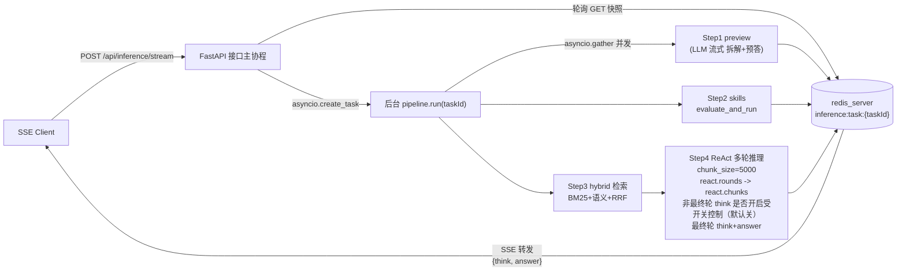

# Fast Inference SSE 模式实现方案

## 1. 整体架构



后台四阶段同时调用 `inference/redis_stream.py` 的 helper 把进度合并写到同一份 JSON 快照；接口主协程不参与计算，纯 redis 转发，因此**断连后台不死、重连可继续**。

## 2. 新建文件结构

```
inference/
  __init__.py
  config.py                    # 默认参数：CHUNK_SIZE=5000, TOP_N=20, TOP_M=20,
                               # PREVIEW_TPS=5, SSE_TICK_MS=100, REACT_MAX_ROUNDS=8,
                               # REACT_INTERMEDIATE_THINK_ENABLED=False,
                               # TASK_KEY_PREFIX="inference:task:", TASK_TTL=86400
  prompts.py                   # PREVIEW_SYSTEM_PROMPT + REACT_SYSTEM_PROMPT
                               # （在 reasoner/v3/prompts.py:CORPUS_SYSTEM_PROMPT 基础上加 ReAct 指令头）
  llm_stream.py                # chat_stream(...) -> AsyncIterator[("think"|"answer", str)]
                               # 复用 llm/client.py 的 vendor 路由；POST stream=True，按 SSE 行解析
                               # delta.reasoning_content -> "think" 通道，delta.content -> "answer" 通道
  embedding_client.py          # embed_texts(texts: list[str], model=...) -> list[list[float]]
                               # HTTP 占位封装（vendor URL/model 由 env 读取，先暴露接口）
  redis_stream.py              # 状态读写门面（基于 redis_server.client.RedisServerClient）
  pipeline.py                  # 主调度 run(task_id, question, policy_id, options) async
  preview.py                   # Step1：preview 阶段（带 TPS 节流写 redis）
  skills_runner.py             # Step2：包一层 skills.evaluate_and_run
  react_loop.py                # Step4：分块 ReAct 多轮推理
  retrieval/
    __init__.py
    indexer.py                 # 离线建索引：扫 page_knowledge/{root}/ 切块+BM25+embedding 落盘
    bm25.py                    # jieba + rank_bm25，加载 page_knowledge/{root}/_bm25.pkl
    semantic.py                # 加载 page_knowledge/{root}/_embeddings.npy + 元数据 jsonl
    rrf.py                     # reciprocal_rank_fusion(rank_lists, k=60) -> ordered ids
    hybrid.py                  # hybrid_search(question, policy_id, top_n=20, top_m=20) -> list[KnowledgeChunk]
  scripts/
    build_indices.py           # CLI：python -m inference.scripts.build_indices --policy-id <id>
```

## 3. Redis 存储约定

单 key：`inference:task:{taskId}` 存一份 JSON 快照（用现有 `RedisServerClient.set/get`，KV 整体覆盖语义即可，所有写入端在进程内用 `asyncio.Lock` 串行化以避免互相覆盖）：

```python
{
  "taskId": "...",
  "policyId": "...",
  "question": "...",
  "status": "pending|preview|reasoning|done|failed",
  "preview": {"think": "", "answer": "", "done": false},
  "skills":  [{"name": "...", "success": true, "stdout": "...", "exitCode": 0}, ...],
  "react":   {"round": 0, "chunks": [{"think": "", "answer": "...", "complete": false}, {"think": "...", "answer": "...", "complete": true}]},
  # 给 SSE 直接消费的两个聚合字段（每次写入 redis 时由 redis_stream.py 重算）：
  # - think: preview 阶段（think+answer）+ ReAct 聚合（受 REACT_INTERMEDIATE_THINK_ENABLED 开关控制）
  # - answer: 仅最终轮的 <answer> 标签内容
  "think":  "<preview.think>\n<preview.answer>\n<if REACT_INTERMEDIATE_THINK_ENABLED=false: react.chunks[final-1].answer + react.chunks[final].think; if true: react.chunks[0..final-1].think+answer 全拼接 + react.chunks[final].think>",
  "answer": "<react.final.answer>",
  "error":  null,
  "createdAt": 0.0, "updatedAt": 0.0
}
```

- 写入路径统一走 `redis_stream.RedisStream.update(task_id, mutator)`：内部 `get → 改 → recompute_aggregates(...) → set`，进程内 `asyncio.Lock` 锁同一 task。
- 提供细粒度 helper：
  - `append_preview(task_id, channel, delta)`
  - `append_react_chunk_delta(task_id, round_idx, channel, delta, is_last_chunk)`
  - `set_react_chunk_complete(task_id, round_idx, complete=True)`
- TTL 用 `set(..., ttl_seconds=TASK_TTL)`。

聚合逻辑建议代码化为单函数（`redis_stream.py`）：

```python
def recompute_aggregates(
    snapshot: dict,
    intermediate_think_enabled: bool,
) -> tuple[str, str]:
    preview = snapshot.get("preview") or {}
    react = snapshot.get("react") or {}
    chunks = react.get("chunks") or []

    think_parts: list[str] = []
    p_think = preview.get("think", "")
    p_answer = preview.get("answer", "")
    if p_think:
        think_parts.append(p_think)
    if p_answer:
        think_parts.append(p_answer)

    answer = ""
    if chunks:
        final_idx = len(chunks) - 1
        final_chunk = chunks[final_idx] or {}
        final_think = final_chunk.get("think", "")
        final_answer = final_chunk.get("answer", "")

        if intermediate_think_enabled:
            for i in range(final_idx):
                c = chunks[i] or {}
                c_think = c.get("think", "")
                c_answer = c.get("answer", "")
                if c_think:
                    think_parts.append(c_think)
                if c_answer:
                    think_parts.append(c_answer)
        else:
            # 默认模式：只把最后一轮之前那一轮的 answer 并入 think（若存在）
            prev_idx = final_idx - 1
            if prev_idx >= 0:
                prev_answer = (chunks[prev_idx] or {}).get("answer", "")
                if prev_answer:
                    think_parts.append(prev_answer)

        if final_think:
            think_parts.append(final_think)
        answer = final_answer

    think = "\n".join(part for part in think_parts if part).strip()
    return think, answer
```

## 4. 关键模块要点

### 4.1 `inference/llm_stream.py`（流式 LLM）

由于 `llm/client.py` 现在 `stream: False`，需要新增（不改老的）：

- `async def chat_stream(messages, system, vendor, model, enable_thinking) -> AsyncIterator[tuple[str, str]]`
- 用 `httpx.AsyncClient.stream("POST", URL, json={..."stream": True...})` 按 `data: {...}` 行解析
- 每条 delta：`reasoning_content` -> 产 `("think", chunk)`；`content` -> 产 `("answer", chunk)`
- 沿用 [llm/client.py](llm/client.py) 现有 vendor URL/Headers/Payload 分支组装

### 4.2 `inference/retrieval/`（混合检索）

- **离线索引（`indexer.py`）**：调用 [reasoner/v3/chunk_builder.py](reasoner/v3/chunk_builder.py) 的 `build_knowledge_chunks(knowledge_root, chunk_size=5000)` 得到 `list[KnowledgeChunk]`，落地三件套到 `page_knowledge/{root}/`：
  - `_chunks.jsonl`：每行 `{index, content, heading_paths, directories}`
  - `_bm25.pkl`：`{tokenized_corpus, BM25Okapi 实例}`（jieba 分词，停用词最小集）
  - `_embeddings.npy`：`(N, dim)` float32，顺序与 `_chunks.jsonl` 对齐
- **`hybrid.hybrid_search(question, policy_id, top_n=20, top_m=20)`**：
  1. `policy_id -> knowledge_root`：用 [extractor/policy_index.py](extractor/policy_index.py) `get_root_map`
  2. 进程内 LRU 缓存按 `policy_id` 懒加载三件套
  3. BM25 取 top_m，semantic（query embedding × 向量库 cosine）取 top_n
  4. `rrf.py:reciprocal_rank_fusion([bm25_rank, sem_rank], k=60)` 重排返回 `list[KnowledgeChunk]`
- 索引缺失时回退：仅 BM25 + 警告日志，**不阻塞流程**。

### 4.3 `inference/preview.py`（Step1，可开关）

- system prompt = `prompts.PREVIEW_SYSTEM_PROMPT`：要求模型先做"财税实务角度问题拆解 → 知识体系 → 回答逻辑"，输出 `<think>…</think><answer>…</answer>`
- 通过 `chat_stream(..., enable_thinking=True)` 拿到双通道流
- **TPS 节流**：用一个 `asyncio.Queue` 把 LLM 增量丢进去，独立任务每 `1/PREVIEW_TPS` 秒从队列取 N 字符 → 调 `redis_stream.append_preview(task_id, channel, delta)` 写 redis；这样 redis 里 preview 字段就是按 5 字/秒节流后的累积内容（接口侧再读它转发，自然就是 5 字/秒的视效）
- 完成后写 `preview.done=true`

### 4.4 `inference/skills_runner.py`（Step2）

```python
from skills import SkillRunner, SkillResultRegistry, evaluate_and_run

async def run(task_id, question, redis_stream):
    registry, runner = SkillResultRegistry(), SkillRunner()
    await evaluate_and_run(question, registry, runner)
    await redis_stream.set_skills(task_id, [
        {"name": r.skill_name, "success": r.result.success,
         "stdout": r.result.stdout, "exitCode": r.result.exit_code}
        for r in registry.get_all()
    ])
```

### 4.5 `inference/react_loop.py`（Step4，复用 CORPUS prompt）

- system prompt = `prompts.REACT_SYSTEM_PROMPT`：在 [reasoner/v3/prompts.py](reasoner/v3/prompts.py) `CORPUS_SYSTEM_PROMPT`（1510-1593 行）基础上**前置 ReAct 指令段**：
  - 当前轮次仅基于已加载的部分知识；
  - 必须输出 `<verdict>complete|incomplete</verdict>` 判定标签；
  - `incomplete` 时只产出 `<think>`，描述"目前缺什么、想要什么继续推"，**禁止产出 `<answer>`**；
  - `complete` 时按 CORPUS 原规范产出 `<think>` + `<answer>`（最终轮）。
- **思考模式策略**：预留 `REACT_INTERMEDIATE_THINK_ENABLED`（默认 `False`）：
  - `False`（默认）：仅最终轮 `enable_thinking=True`；非最终轮 `enable_thinking=False`，非最终轮 `chunk.think=""`；
  - `True`：非最终轮也 `enable_thinking=True`，并保留每轮 `chunk.think` 与 `chunk.answer`。
- **redis 写入约定**（与 Section 3 一致）：
  - 每轮都写入 `react.chunks[round_idx]`；
  - 最终轮始终写 `<think>` 与 `<answer>` 到最终 chunk，且接口 `answer` 仅取最终轮 `<answer>`；
  - SSE 聚合 `think` 规则：
    - 开关为 `False`：`preview.* + react.chunks[final-1].answer + react.chunks[final].think`
    - 开关为 `True`：`preview.* + 非最终轮(think+answer)全拼接 + 最终轮think`
- 主循环：
  ```python
  retrieved = await hybrid_search(question, policy_id, ...)   # Step3 结果
  groups = pack_chunks_by_size(retrieved, CHUNK_SIZE=5000)    # 复用 reasoner/v3/chunk_builder.py 拼接逻辑
  prev_think = ""
  for round_idx, group_text in enumerate(groups):
      preview_snapshot = await redis_stream.get_preview(task_id)
      skills_snapshot  = await redis_stream.get_skills(task_id)   # 每轮重读，捕获新出的 skill
      user_prompt = REACT_USER_PROMPT.format(
          question=question, evidence=group_text,
          prev_think=prev_think, preview_block=..., skill_context_block=...,
      )
      is_last_chunk = (round_idx == len(groups) - 1)
      # 流式：每个 delta 先写回 react.chunks，再调用 recompute_aggregates(...) 重算快照 think/answer
      # 最终轮: think -> 接口 think, answer -> 接口 answer
      # 非最终轮: 开关开则 think+answer -> 接口 think；开关关则仅保留 chunk.answer，不进入接口 answer
      verdict, full_think, full_answer = await stream_react_round(
          REACT_SYSTEM_PROMPT, user_prompt,
          enable_thinking=(is_last_chunk or REACT_INTERMEDIATE_THINK_ENABLED),
          force_complete=is_last_chunk,
          on_think_delta=lambda s: redis_stream.append_react_chunk_delta(
              task_id, round_idx, "think", s, is_last_chunk=is_last_chunk
          ),
          on_answer_delta=lambda s: redis_stream.append_react_chunk_delta(
              task_id, round_idx, "answer", s, is_last_chunk=is_last_chunk
          ),
      )
      prev_think += full_think
      if verdict == "complete":
          return
  ```
- `stream_react_round` 内部维护一个轻量"标签状态机"（在增量字符串上扫 `<think>` / `</think>` / `<answer>` / `</answer>` 边界），把进入 think 区段的 delta 走 `on_think_delta`、进入 answer 区段的 delta 走 `on_answer_delta`；同时缓存 `<verdict>` 标签内容用于循环判定。

### 4.6 `inference/pipeline.py`（总调度）

```python
async def run(task_id, question, policy_id, options):
    rs = RedisStream(...)
    await rs.init(task_id, question, policy_id)
    try:
        retrieval_t = asyncio.create_task(hybrid_search(question, policy_id, ...))
        preview_t   = asyncio.create_task(preview.run(task_id, question, rs)) if options.preview_enabled else None
        skills_t    = asyncio.create_task(skills_runner.run(task_id, question, rs))
        chunks      = await retrieval_t
        await react_loop.run(task_id, question, chunks, rs, skills_task=skills_t, preview_task=preview_t)
        await rs.set_status(task_id, "done")
    except Exception as e:
        await rs.set_status(task_id, "failed", error=str(e))
```

## 5. SSE 接口（注册到现有 `app.py`）

最小侵入：在 [app.py](app.py) 末尾追加一段路由（不改老的推理接口），仅新增：

```python
from inference.pipeline import run as _inference_run
from inference.redis_stream import RedisStream
from fastapi.responses import StreamingResponse

@app.post("/api/inference/stream")
async def inference_stream(req: InferenceRequest):
    task_id = req.taskId or str(uuid.uuid4())
    rs = RedisStream(_require_redis())
    if not await rs.exists(task_id):
        knowledge_dir = await asyncio.to_thread(_get_or_extract_knowledge, req.policyId)  # 复用现有
        asyncio.create_task(_inference_run(task_id, req.question, req.policyId, req.options))
    return StreamingResponse(_sse_relay(task_id, rs), media_type="text/event-stream")
```

`_sse_relay`：每 `SSE_TICK_MS` 取一次快照，hash 比较 `(think, answer, status)` 变化才推；推送格式：

```
event: snapshot
data: {"taskId":"...", "think":"...", "answer":"...", "status":"reasoning"}
```

终止条件：`status in {done, failed}` 后再推一次，断流；客户端断连不影响后台。

## 6. 离线索引 CLI

`python -m inference.scripts.build_indices --policy-id <id>`：解析 policyId → knowledge_root → 切块 → 调 `embedding_client.embed_texts`（分批） → 落 `_chunks.jsonl` / `_bm25.pkl` / `_embeddings.npy`。新 policy 入库（`extract_from_api` 之后）后人工或定时触发即可。

## 7. 复用清单（不改原文件）

- [llm/client.py](llm/client.py)：仅参考其 vendor 路由结构，新增 `inference/llm_stream.py`，**不动老的 `chat`**
- [reasoner/v3/chunk_builder.py](reasoner/v3/chunk_builder.py)：直接 import `build_knowledge_chunks` 与 `KnowledgeChunk`
- [reasoner/v3/prompts.py](reasoner/v3/prompts.py)：直接 import `CORPUS_SYSTEM_PROMPT` / `CORPUS_USER_PROMPT` 做 string concat
- [skills/__init__.py](skills/__init__.py)：直接 `from skills import evaluate_and_run, SkillRunner, SkillResultRegistry`
- [extractor/policy_index.py](extractor/policy_index.py)：`get_root_map` + 复用 `app.py:_get_or_extract_knowledge`
- [redis_server/client.py](redis_server/client.py)：`RedisServerClient.set/get`（单 key 整体覆盖即可）
- [utils/helpers.py](utils/helpers.py)：`split_think_block` 兜底解析
- 现有的 `_redis_client` lifespan（已在 [app.py](app.py) 启动）直接复用

## 8. 修改文件清单

- [app.py](app.py)：追加 `/api/inference/stream` 路由 + `InferenceRequest` Pydantic 模型，**不动现有推理接口**
- [requirements.txt](requirements.txt)：新增 `rank_bm25`、`jieba`、`numpy`
- 不改 `reasoner/`、`extractor/`、`skills/`、`redis_server/`、`llm/` 任何源文件

## 9. 风险与回退

- **embedding 服务未给定时**：`embedding_client` 抛 NotImplementedError → `hybrid` 回退纯 BM25，pipeline 仍可跑通（用户已确认外部 API，先占位）
- **redis_server 单 key 覆盖竞态**：通过进程内 `asyncio.Lock(per task_id)` 串行化所有写入端，避免 Step1/2/4 互相覆盖
- **SSE 长连接**：依赖现有 `_redis_client` 短请求池（pool_timeout=2s），转发是高频短 GET，符合该池语义；不会与 worker 长轮询互相挨饿
- **ReAct 死循环**：`REACT_MAX_ROUNDS` 上限到达后强制按"最终轮"出 answer
- **断点续传**：因 redis 单 key 已含全量快照，重连只需基于当前 think/answer 作起点继续推送，无需 diff 重放