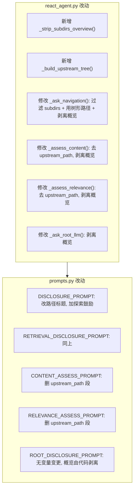

# 优化 Backtrack 防重复披露及变量加载逻辑

## 涉及文件

- [reasoner/react_agent.py](reasoner/react_agent.py) — 变量加载与格式化逻辑
- [reasoner/prompts.py](reasoner/prompts.py) — Prompt 模板

---

## 一、防止重复披露（对 DISCLOSURE_PROMPT / RETRIEVAL_DISCLOSURE_PROMPT）

在 `_ask_navigation()` 中，通过 `ExploredRegistry` 过滤已探索路径，让 LLM 完全不可见：

**1a. 过滤 `available_subdirs`**

在构建 `subdirs_str` 之前，用 `registry.is_explored(full_path)` 过滤掉已被任何 agent 认领的子目录：

```python
# react_agent.py _ask_navigation() 中
filtered_subdirs = [
    d for d in available_subdirs
    if not (self.registry and self.registry.is_explored(
        os.path.join(current_dir, d)
    ))
]
subdirs_str = "\n".join(f"- {d}" for d in filtered_subdirs) if filtered_subdirs else "（无子目录）"
```

**1b. 上游路径树中过滤已探索的上级目录和平级目录**（见下文第二点）

---

## 二、上游探索路径改为「路径树 + 可回溯目录」格式

当前 `upstream_path` 只展示一条线性路径。改为在每层展示**未探索的平级目录**，并**整体过滤掉已无探索价值的上级层级**，帮助 LLM 做 BACKTRACK 决策。

新增方法 `_build_upstream_tree()` in `react_agent.py`：

核心过滤逻辑：
1. **过滤平级目录**：每层只展示未被 `ExploredRegistry` 认领的兄弟目录
2. **过滤上级目录（整层移除）**：如果某个上级层级的所有平级目录都已被探索（无可回溯选项），则该层级整体从树中移除，不展示给 LLM

```python
def _build_upstream_tree(self, current_dir: str) -> str:
    """构建上游路径树，每层附带未探索的平级目录；无可探索平级的上级层级整体移除"""
    lines = []
    for i, dir_path in enumerate(self.upstream_path):
        name = os.path.basename(dir_path)
        is_current = (dir_path == current_dir)

        # 列出同级未探索的兄弟目录
        parent = os.path.dirname(dir_path)
        unexplored = []
        if parent and os.path.isdir(parent):
            siblings = self._list_subdirs(parent)
            unexplored = [
                s for s in siblings
                if s != name and not (
                    self.registry and self.registry.is_explored(
                        os.path.join(parent, s)
                    )
                )
            ]

        # 过滤上级目录：非当前位置且无可回溯平级目录的层级，整体跳过
        if not is_current and not unexplored:
            continue

        indent = "  " * len(lines)  # 动态缩进（跳过的层级不占位）
        label = f"{indent}→ {name}" + (" ← 当前位置" if is_current else "")
        lines.append(label)

        if unexplored:
            lines.append(f"{indent}  可回溯探索的平级目录: {', '.join(unexplored)}")
    return "\n".join(lines) if lines else "（所有上游路径均已探索）"
```

示例：假设根目录下 `0_精简版` 已被其他 agent 探索完毕，其余未探索

```
→ 3_涉税处理
  可回溯探索的平级目录: 1_指南说明, 2_会计处理, 4_实务操作, 5_高频"踩坑"风险与应对策略, 6_附件（农产品范围）
  → 3.1_增值税
    可回溯探索的平级目录: 3.2_企业所得税, 3.3_其他税种
    → 3.1.2_进项税额 ← 当前位置
      可回溯探索的平级目录: 3.1.1_..., 3.1.3_销项税额, 3.1.4_发票开具规范
```

若根目录层级所有平级目录均已探索，则根节点层级不展示（被过滤）。当前位置层级始终保留。

在 `_ask_navigation()` 中用 `_build_upstream_tree(current_dir)` 替换原来的 `" -> ".join(self.upstream_path)`。

---

## 三、剥离 knowledge.md 中的「子目录概览」冗余段落

新增方法 `_strip_subdirs_overview()` in `react_agent.py`：

```python
def _strip_subdirs_overview(self, content: str) -> str:
    """去除 knowledge.md 中的 '## 子目录概览' 段落（含尾部引用块）"""
    marker = "## 子目录概览"
    idx = content.find(marker)
    if idx == -1:
        return content
    return content[:idx].rstrip()
```

**使用场景**：
- **DISCLOSURE / RETRIEVAL_DISCLOSURE**（路径探索）：剥离子目录概览，因为 `{available_subdirs}` 已提供这些信息
- **CONTENT_ASSESS**（知识总结）：剥离子目录概览，对内容评估无用
- **RELEVANCE_ASSESS**（相关性判断）：剥离子目录概览，对相关性判断无用
- **ROOT_DISCLOSURE**（根节点探索）：同理剥离

---

## 四、CONTENT_ASSESS 和 RELEVANCE_ASSESS 去除冗余变量

**去掉 `{upstream_path}`**：这两个 prompt 负责内容评估/相关性判断，上游路径对其没有价值。

prompts.py 修改：

**CONTENT_ASSESS_PROMPT**（约第 72-111 行）：删除以下段落
```
## 上游探索路径
{upstream_path}
```

**RELEVANCE_ASSESS_PROMPT**（约第 472-505 行）：删除以下段落
```
## 上游探索路径
{upstream_path}
```

react_agent.py 对应修改：
- `_assess_content()` — 删除 `upstream_str` 构建和 `upstream_path=upstream_str` 参数
- `_assess_relevance()` — 同上

---

## 五、鼓励多方向探索（DISCLOSURE_PROMPT + RETRIEVAL_DISCLOSURE_PROMPT）

在两个 Prompt 模板的指令部分增加多方向探索鼓励，强调三个维度：

1. **向下深入**：进入当前子目录获取更细粒度知识
2. **平级横向**：通过 BACKTRACK 回到父目录，探索未披露的同级目录
3. **向上回溯**：回到更高层级获取更宏观的上下文或探索其他分支

在 `### 其他注意事项` 部分追加：

```
- **鼓励全面探索**：优先深入子目录获取细粒度知识；如果当前路径信息不足，积极回溯到上游探索平级目录（参考"上游探索路径"中列出的可回溯平级目录）；必要时回到更高层级获取全局视角
```

同时在 `## 上游探索路径` 的标题描述中加注：

```
## 上游探索路径（含各层级可回溯的平级目录）
{upstream_path}
```

---

## 六、关于知识块路径记录的现状说明（第 5 点确认结果）

| 模式 | 路径记录 | 数据结构 | 输出位置 |
|---|---|---|---|
| **召回模式** | 有，`KnowledgeFragment.directory_path` + `heading_path` | `RetrievalKnowledgeRegistry._fragments` | `_organize_fragments()` -> `_retrieval_final_summary()` |
| **标准模式** | 仅 `AgentResult.explored_dir`（agent 起始目录），证据无精确路径标注 | `AgentResult.evidence: list[str]` | `_build_evidence_parts()` -> `_final_summary()` |

标准模式的 `trace_log` 中通过 `TraceStep.directory` 记录了每轮探索的目录，但**证据文本与具体目录的关联**没有结构化存储（`_build_trace_log()` 在 `agent_graph.py` 576-595 行输出）。

本次优化暂不涉及标准模式的路径标注增强（可作为后续 TODO）。

---

## 改动汇总


