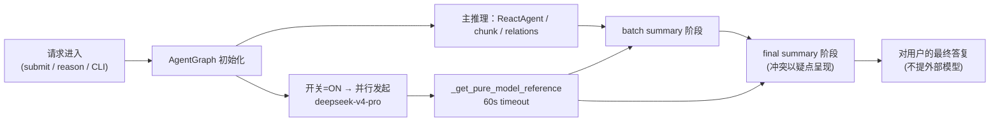

## 范围与开关行为
- CLI [main.py](main.py) / HTTP [app.py](app.py) 新增开关；默认 `false`，关闭时完全保持现有行为。
- v1 + v2 AgentGraph 对等改造；v0 透传但直接告警忽略（v0 无对应 prompts 分层）。
- 外部模型固定 `vendor/model = "deepseek-v4-pro"`（参考 [llm/client.py:80-92](llm/client.py)），超时 60s，失败/超时退化为"无外部参考"原流程。

## 外部请求设计（`_start_pure_model_request_async`）
- 入口：在 `AgentGraph.run()` 最开始、`_run_impl()` / `_run_chunk_mode()` 分支之前触发；存 `self._pure_model_future`（单独 `ThreadPoolExecutor(max_workers=1)`，推理结束在 `_shutdown_relation_executors` 同位置一并释放）。
- 系统提示：直接复用现有 `SUMMARY_SYSTEM_PROMPT`（[reasoner/v2/prompts.py:256](reasoner/v2/prompts.py)，v1 同名）。
- 用户提示（新增常量 `PURE_MODEL_REQUEST_PROMPT`）：
  - 模板 `{question}`
  - 硬约束：回答总字数 ≤ 500 字；必须分「判断逻辑 / 关键证据 / 有效期限」三段呈现；失败缺项处明确说明。
- 阻塞取值：`_get_pure_model_reference()`，带 60s 超时 + 结果缓存（只 block 一次，后续复用）。失败/超时写 WARN 并返回空串，下游全部降级为"无外部参考"。

## Prompt 注入策略
- 新增 user prompt 注入辅助 `_append_pure_model_reference_to_prompt()`：复用现有 [reasoner/v2/agent_graph.py:474](reasoner/v2/agent_graph.py) 的锚点正则，把「## 参考回答」块追加到 `## 用户问题\n{question}` 后、下一个 `#/##` 小节之前（与 skill_context 插入逻辑同构，二者按「skill → 参考回答」顺序依次插入）。
- 新增 system 追加文案常量（放到 `prompts.py`，英文键名）：
  - `PURE_MODEL_REFERENCE_EXTRACT_INSTRUCTIONS`：指导 batch summary 中间阶段参考外部回答做知识摘录——支撑 / 修正 / 冲突全收。
  - `PURE_MODEL_REFERENCE_ANSWER_INSTRUCTIONS`：指导 final summary 阶段按「疑点」方式呈现冲突；明确不得透露存在外部模型参考、不得出现「根据外部模型…」等指代措辞。
- 注入时机（仅当 `_get_pure_model_reference()` 拿到非空文本时生效）：
  - 所有 batch summary 中间节点（user prompt 注入参考块 + system 末尾追加 EXTRACT 指令）：
    - v2：[`_recursive_batch_reduce`](reasoner/v2/agent_graph.py) 内 `BATCH_SUMMARY_PROMPT`、[`_retrieval_recursive_batch_reduce`](reasoner/v2/agent_graph.py) 内 `RETRIEVAL_BATCH_SUMMARY_PROMPT`。
    - reduce_queue：[`_reduce_queue_run_over_parts`](reasoner/v2/agent_graph.py) 构造 `ReducePipeline` 时，`intermediate_prompt` 预先做参考块替换（以 `## 用户问题\n{question}` 作为锚点一次性替换），`intermediate_system_prompt` 追加 EXTRACT 指令；不改 `reduce_pipeline.py` 接口。
  - 所有 final summary 节点（user prompt 注入参考块 + `self.answer_system_prompt` 末尾追加 ANSWER 指令）：
    - `_final_summary` / `_batch_final_merge` / `_retrieval_final_summary` / `_retrieval_batch_final_merge`。
    - 覆盖其内部所有 `*_AND_CLEAN_PROMPT` / `*_AND_CLEAN_THINK_PROMPT` 分支（ANSWER 指令中要求：输出答复中不得暴露外部模型、冲突以「疑点」措辞说明）。
  - `_all_in_answer`（慢速路径 double-check 修订）不再重复注入——它消费的是已包含外部参考的 final_summary 草稿。
  - `CLEAN_ANSWER_PROMPT` / `CHUNK_REASONING_*` / ReactAgent 探索阶段不注入（与用户需求一致，只覆盖 batch summary + final summary）。

## 配置参数传递链
- [main.py](main.py)：`reason` 子命令新增 `--pure-model-result`（`store_true`，默认 `False`）；注入 `common_kwargs["pure_model_result"]`（v1/v2 分支内都加；v0 侧沿用现有"仅警告不生效"模式）。
- [app.py](app.py) `ReasonRequest`：新增 `pureModelResult: bool = Field(default=False, ...)`；`_run_reasoning` / `_reason_executor` 签名加 `pure_model_result`，转发到 `AgentGraph` 构造参数。
- [reasoner/v1/engine.py](reasoner/v1/engine.py) + [reasoner/v2/engine.py](reasoner/v2/engine.py)：`run_single_question` / `run_reasoning` / `_process_single_question` / `_run_sequential` / `_run_parallel` 全链路加 `pure_model_result` 关键字；在 `AgentGraph(...)` 构造时传入。
- [reasoner/v1/agent_graph.py](reasoner/v1/agent_graph.py) + [reasoner/v2/agent_graph.py](reasoner/v2/agent_graph.py) `__init__`：保存字段 + 初始化 `self._pure_model_future / _pure_model_executor / _pure_model_reference / _pure_model_lock`。
