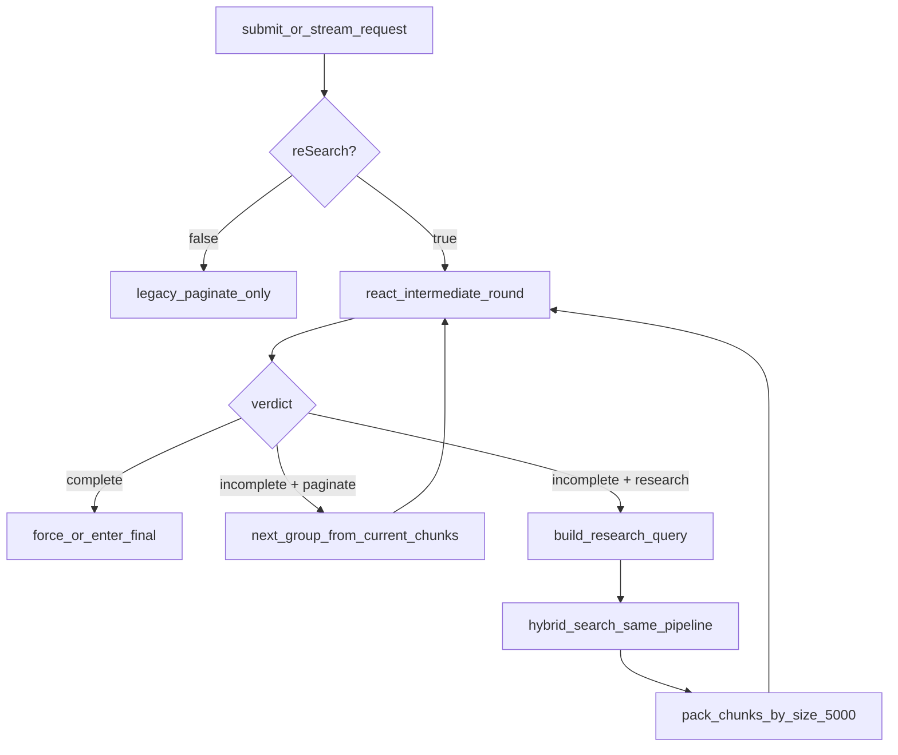

# ReAct 重检索模式升级方案

## 目标与边界

- 在中间轮 verdict 为 `incomplete` 时，模型可输出下一轮动作：
  - `paginate`：继续消费当前召回结果的后续 chunk 组（保留现有 5000 字阈值组包逻辑）；
  - `research`：给出一条“空格分隔”的混合检索字符串，触发一次新的独立召回（复用当前 `hybrid_search` 全链路）。
- 新增 `reSearch` 参数到 `submit` 与 `stream` 请求体，默认 `true`；当 `false` 时退化为当前“仅翻页”行为。
- 不改动召回算法本身（语义 + BM25 + RRF + 既有后排序），只改 ReAct 的“下一轮证据来源决策”。

## 现状锚点（将复用）

- ReAct 主循环与“5000 字组包 + forced final”在 `[inference/react_loop.py](inference/react_loop.py)`。
- 中间轮/最终轮提示词选择在 `[inference/prompts.py](inference/prompts.py)`。
- 混合召回入口（可直接复用）在 `[inference/retrieval/hybrid.py](inference/retrieval/hybrid.py)` 的 `hybrid_search(...)`。
- 参数入口：
  - `submit`（含 v4 执行链）在 `[app.py](app.py)` 的 `ReasonRequest` / `_run_inference_v4_executor`；
  - `stream` 在 `[app.py](app.py)` 的 `InferenceRequest` / `_build_inference_options` / `inference_stream`。
- Pipeline 选项承载在 `[inference/pipeline.py](inference/pipeline.py)` 的 `InferenceOptions`。

## 设计方案




### 1) 中间轮协议升级（Prompt + 解析）

- 严格双路径（避免侵入旧逻辑）：
  - `reSearch=false`：沿用原有中间轮 prompt（只输出 `complete|incomplete`）与原有翻页推理逻辑，不改旧分支行为；
  - `reSearch=true`：启用新增强 prompt（answer 内子标签协议）与 research 分支能力。
- `reSearch=true` 时，调整中间轮输出协议为统一内嵌结构（兼容旧格式）：
  - `<answer><completion>complete|incomplete</completion><action>paginate|research</action><search-query>词1 词2 词3</search-query></answer>`
- `reSearch=true` 分支约束规则（按你确认的口径）：
  1. 当 `<completion>complete</completion>` 时，prompt 必须明确要求模型**禁止输出** `<action>` 与 `<search-query>` 子标签；
  2. 当 `<completion>incomplete</completion>` 且 `reSearch=true` 时，`<action>` 必填；
  3. 当 `action=research` 时，`<search-query>` 必填，且必须是单行、空格分隔；
  4. `reSearch=false` 分支不进入新协议解析，直接走旧协议与旧翻页逻辑。
- 解析优先级：
  1. `reSearch=false`：只按旧协议解析（历史 `<answer>` 直接承载 `complete|incomplete`），不解析新子标签；
  2. `reSearch=true`：先解析 `<answer>...</answer>`，再从 answer 内解析 `<completion>/<action>/<search-query>`；
  3. `reSearch=true` 且 `<completion>=complete` 时，解析端兜底直接忽略 `<action>/<search-query>` 内容（即使模型违规输出也不生效）；
  4. `reSearch=true` 且新子标签缺失时，回退旧协议并默认 `action=paginate`。
  5. `reSearch=true` 且模型输出结构异常（标签错位/闭合错误/跨流式片段无法恢复）时：先尝试按旧协议从 `<answer>` 解析 `completion`；若连 `completion` 都无法可靠解析，则本轮 ReAct **强制按原始翻页逻辑执行**（等价 `action=paginate`），不中断主流程。
- 扩展流式标签路由：在现有解析能力上支持 answer 内子标签的增量拼装，确保半截标签（跨 chunk）也能正确恢复。

#### 1.1 `reSearch=true` 专用中间轮 Prompt 模板（最小改动复制）

- 设计原则：从现有 `[inference/prompts.py](inference/prompts.py)` 的 `REACT_INTERMEDIATE_SYSTEM_PROMPT` / `REACT_INTERMEDIATE_USER_PROMPT` 直接复制，仅替换“输出格式约束”与“action/search-query 决策语义”；其余上下文段落（用户问题、参考依据、前置预答、历史摘要、本轮证据）保持不变。
- 命名建议（新增，不覆盖旧模板）：
  - `REACT_INTERMEDIATE_RESEARCH_SYSTEM_PROMPT`
  - `REACT_INTERMEDIATE_RESEARCH_USER_PROMPT`（可直接复用现有 `REACT_INTERMEDIATE_USER_PROMPT` 文本）
- `REACT_INTERMEDIATE_RESEARCH_SYSTEM_PROMPT` 草案（基于旧版最小改造）：

```text
你是一个资深财税实务专家。你的目标是判断当前掌握的信息是否已经足以完美回答用户问题。

请严格按以下结构输出：

1. <think>...</think>：
   复盘本轮观察到了什么、与问题的关联，是否已覆盖核心结论/关键依据/必要操作或风险提示；
   若仍不充分，明确说明还缺什么、下一轮希望补充哪类知识。

2. <answer>...</answer>：
   在 answer 内按以下子标签输出（标签顺序固定）：
   - 先判断是否足以完美回答用户问题 必须输出 <completion>complete|incomplete</completion>
   - 当 completion=incomplete 时必须输出 <action>paginate|research</action>
   - 当 action=research 时必须输出 <search-query>...</search-query>
     （内容必须是单行、关键词/短语以空格分隔）

【绝对约束】
- 禁止类比推理，必须有信息明文给出直接证据。
- 输出顺序固定：<think>...</think><answer>...</answer>。
- 当 completion=complete 时，禁止输出 <action> 与 <search-query>（若误输出也会被系统忽略）。
- 当 completion=incomplete 且 action=paginate 时，禁止输出 <search-query>。
- 仅允许输出上述标签，不要输出任何其他标签或解释性前后缀。
```

- `REACT_INTERMEDIATE_RESEARCH_USER_PROMPT` 草案：与现有 `REACT_INTERMEDIATE_USER_PROMPT` 完全一致（最小改动，不新增变量）。
- 选择逻辑：
  - `reSearch=false`：沿用旧 `REACT_INTERMEDIATE_SYSTEM_PROMPT`；
  - `reSearch=true`：切换到 `REACT_INTERMEDIATE_RESEARCH_SYSTEM_PROMPT`；
  - 两条路径共用同一份 user prompt 模板，避免上下文漂移。

### 2) ReAct 循环改造为“动作驱动”

- 在 `[inference/react_loop.py](inference/react_loop.py)` 中采用参数开关分流：
  - `reSearch=false`：保持原有“固定遍历 groups + incomplete=继续翻页”逻辑，不侵入；
  - `reSearch=true`：启用新状态机（current_chunks + packed_groups + group_idx），每轮根据 `completion/action` 决定 `paginate` 或 `research`；
  - `reSearch=true` 且 `research` 时，使用 `<search-query>` 调用 `hybrid_search(search_query, policy_id, top_n, top_m)`；
    - 在替换前执行**单向删减**：从“新证据集”中删去那些与“老证据集中已送入 ReAct 循环的知识块”重复的项（老证据集本身不改）；
    - 判重参照集合仅为“老证据集中已进过 ReAct 的块”，不包含老集合里尚未进入 ReAct 的块；
    - 去重键优先使用稳定标识（如 chunk 的唯一 id / source + heading_path + content_hash）；若缺少稳定 id，则降级用规范化文本 hash（trim + 统一空白）；
    - 单向删减后若新集合为空，则本轮按 `paginate` 兜底，不中断任务；否则用删减后的新集合替换当前证据集并重置 `group_idx`。
    - `reSearch=true` 下若本轮解析结果不可用（含兜底失败），执行器直接按 `paginate` 处理，进入下一组证据，不报错、不终止任务。
- 保持现有 final 行为：
  - `complete` 触发 forced final；
  - 到达最后可用证据组或 rounds 上限时走 final。
- 保留并复用现有锁语义与聚合语义（`intermediateLocked` / `finalLocked` / usedHeadings）。

### 3) 参数链路新增 `reSearch`（默认 true）

- 在 `[app.py](app.py)` 中新增：
  - `ReasonRequest.reSearch: bool = True`（submit/reason v4 链路）；
  - `InferenceRequest.reSearch: bool = True`（stream 链路）。
- 在 `[inference/pipeline.py](inference/pipeline.py)` 的 `InferenceOptions` 新增 `re_search_enabled`，并由 `_build_inference_options` 透传。
- 在 v4 executor 路径（`_run_inference_v4_executor`）也显式透传该参数到 `run_react_loop`。

### 4) 复用检索链路与可观测性

- 复用已有 `hybrid_search` 全流程，不新增新的检索实现。
- 在 verbose 事件里补充每轮动作记录：`round`, `completion`, `action`, `search_query`, `retrieved_count`，用于回放定位。
- 对 `<search-query>` 做轻量防护：空串/纯空白时回退 `paginate`；可选追加去重防抖（同 query 连续命中时限制次数）。

### 5) 兼容与回滚策略

- `reSearch=false`：强制沿用旧 prompt + 旧“仅 paginate/翻页”逻辑，新协议与新解析完全不介入。
- `reSearch=true`：启用新 prompt + 新解析 + research 分支；若新标签缺失，按旧协议将中间轮当作 `paginate`。
- 不改外部响应 schema，确保前端消费 `snapshot` / `ReasonData` 不受影响。

## 实施顺序

1. 引入 `reSearch` 双路径分流：先确保 `false` 分支完全复用旧 prompt 与旧翻页逻辑。
2. 仅在 `reSearch=true` 分支升级中间轮 prompt 协议与解析器（先保证单轮可解析出 action/query）。
3. 仅在 `reSearch=true` 分支改造 `react_loop` 状态机并接入 `hybrid_search` 重检索分支。
4. 打通 `reSearch` 参数在 `submit` 与 `stream` 两条链路透传。
5. 增加日志与回退策略；补充/更新测试。

## 验收与测试要点

- `reSearch=true`：
  - `incomplete+paginate` 正常翻页；
  - `incomplete+research` 触发新检索并进入下一轮；
  - `complete` 仍触发最终轮输出。
- `reSearch=false`：任何中间轮都不会触发重检索。
- 边界：query 空、重复 query、无召回、maxRounds 上限、topic-locator 路径、v4 submit 与 stream 两入口一致性。
- 回归：SSE 聚合顺序、最终 `think/answer` 收口、`khObj` 生成与已有逻辑一致。

