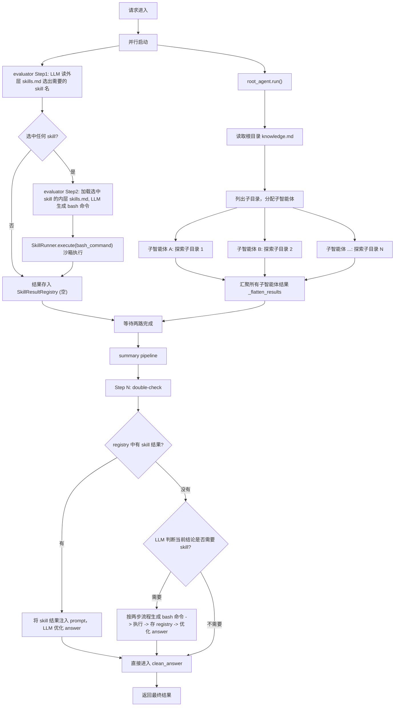

# Skill 集成到推理流程

## 整体流程



## 需要创建/修改的文件

### 1. 新建 `skills/registry.py` — SkillResultRegistry

参照 `PitfallsRegistry`（[reasoner/v0/agent_graph.py](reasoner/v0/agent_graph.py) L48-78）的线程安全模式：

- 线程安全（`threading.Lock`）
- `add(skill_name, command, result)` 存储「skill 名 + 实际执行的 bash 命令 + `SkillExecutionResult`」
- `get(skill_name)` / `get_all()` / `has(skill_name)`
- `format_context()` 把所有 skill 结果格式化为可直接注入 LLM prompt 的自然语言文本（`r.stdout` 已经是面向大模型的可读文本）

### 2. 新建 `skills/evaluator.py` — 两步式 Skill 评估器

职责：接收问题，**LLM 选 skill → LLM 生成 bash → SkillRunner 执行 → 写入 registry**。

#### Step 1: 选 skill（轻量 LLM 调用）

- 加载外层 [skills/skills.md](skills/skills.md)（仅技能名 + 描述 + entry_cmd 模板）
- Prompt 让 LLM 输出形如 `["standard_product_name_verification", ...]` 的 JSON 数组；空数组代表无需任何 skill
- 一次 LLM 调用决定 0~N 个 skill

#### Step 2: 生成命令（按选中 skill 数量调用）

- 对每个选中的 skill_name：
  - 读取 `skills/<skill_name>/skills.md`（详细文档 + 调用示例）
  - Prompt 让 LLM 直接输出一行 bash 命令（仅命令本身，不带 markdown ```围栏）
- 多个 skill 之间互相独立，可在线程池并行做 Step 2

#### Step 3: 执行

- 通过 `await runner.execute(bash_command)` 在沙箱执行
- 把 `(skill_name, command, SkillExecutionResult)` 写入 registry

公开接口：

```python
async def evaluate_and_run(
    question: str,
    registry: SkillResultRegistry,
    runner: SkillRunner,
    vendor: str = "aliyun",
    model: str = "deepseek-v3.2",
) -> None: ...
```

由于 `evaluator` 内部用 `runner.execute()`（async），AgentGraph 那边并行启动时需要包一层 `asyncio.run()` 在线程里执行。

### 3. 新建 `skills/double_check.py` — Double-check 阶段

职责：在 summary pipeline 之后、`_clean_answer` 之前执行。

- `check_and_enhance(question, raw_answer, registry, runner)` — 核心函数
  - **若 registry 已有结果**：将 `registry.format_context()` 与 `raw_answer` 一同丢给 LLM，让 LLM 判断 skill 结果是否真的对当前回答有帮助；有帮助则生成增强版 answer，否则原样返回
  - **若 registry 为空**：调用 LLM 基于 `raw_answer` 评估是否还需要 skill；若需要则复用 evaluator 的两步流程（直接 `await evaluate_and_run()`）补一轮 skill 调用，再做注入优化

### 4. 修改 `reasoner/v1/agent_graph.py` — 集成点

在 `AgentGraph.__init__` 中新增（注意默认开启）：

- `enable_skills: bool = True` 形参 → `self.enable_skills`
- `self.skill_registry = SkillResultRegistry() if enable_skills else None`
- `self.skill_runner = SkillRunner() if enable_skills else None`

在 `run()` 中，skill 评估与 root_agent 推理**并行执行**（`ThreadPoolExecutor`），在 summary pipeline 前汇合。由于 evaluator 是 async，需要在线程内用 `asyncio.run()` 启动事件循环。`enable_skills=False` 时整段 skill 逻辑短路：

```python
def _run_skill_evaluation(self) -> None:
    asyncio.run(evaluate_and_run(
        self.question, self.skill_registry, self.skill_runner,
        vendor=self.vendor, model=self.model,
    ))

def run(self) -> dict:
    if self.chunk_size > 0:
        return self._run_chunk_mode()

    if self.enable_skills:
        # Skill 评估 与 主推理 并行
        with ThreadPoolExecutor(max_workers=2) as executor:
            skill_future     = executor.submit(self._run_skill_evaluation)
            reasoning_future = executor.submit(self._run_root_agent_and_flatten)
            reasoning_future.result()
            skill_future.result()
    else:
        self._run_root_agent_and_flatten()

    answer = self._retrieval_pipeline() or self._standard_pipeline()

    if self.enable_skills:
        answer = asyncio.run(check_and_enhance(
            self.question, answer, self.skill_registry, self.skill_runner,
            vendor=self.vendor, model=self.model,
        ))

    if self.clean_answer:
        answer = self._clean_answer(answer)
    # ...
```

`_run_chunk_mode()` 中同理：`enable_skills=True` 时与 `_chunk_pipeline` 并行执行 skill 评估，`False` 时跳过。

`reasoner/v0/agent_graph.py` 同步加 `enable_skills` 形参（默认 `True`），保持双版本对齐。

### 5. 修改 `reasoner/v0/engine.py` 与 `reasoner/v1/engine.py` — 透传开关

`run_single_question()` 和 `run_reasoning()` 都新增形参 `enable_skills: bool = True`，原样透传给 `AgentGraph(...)`。

### 6. 修改 [main.py](main.py) — 新增 CLI 参数

`reason` 子命令下新增：

```python
reason_parser.add_argument(
    "--disable-skills", action="store_true", default=False,
    help="禁用 skill 系统：不进行 skill 预评估，也不在 clean_answer 前做 double-check。默认开启 skill。"
)
```

`cmd_reason()` 调用时统一换算成 `enable_skills=not args.disable_skills` 传给 engine。

### 7. 修改 [app.py](app.py) — HTTP 接口兼容

`ReasonRequest` 新增字段（默认 `True`，老调用方不传也走 skill 流程）：

```python
class ReasonRequest(BaseModel):
    policyId: str
    question: str
    chunkSize: int = Field(default=5000, ...)
    enableSkills: bool = Field(default=True, description="是否在推理流程中启用 skill 系统")
```

在 `_run_reasoning()` 中接收并透传：`AgentGraph(..., enable_skills=enable_skills)`。
对应 `/api/reason` 路由把 `req.enableSkills` 传下去。

## 不需要改动的文件

- [skills/runner.py](skills/runner.py) — bash 沙箱执行器，evaluator/double_check 直接调用 `runner.execute(bash_command)`
- [skills/skills.md](skills/skills.md) — 已是简洁的索引格式（含 entry_cmd 模板），evaluator Step 1 直接复用
- [skills/standard_product_name_verification/](skills/standard_product_name_verification/) — CLI 入口与详细文档保持原样
