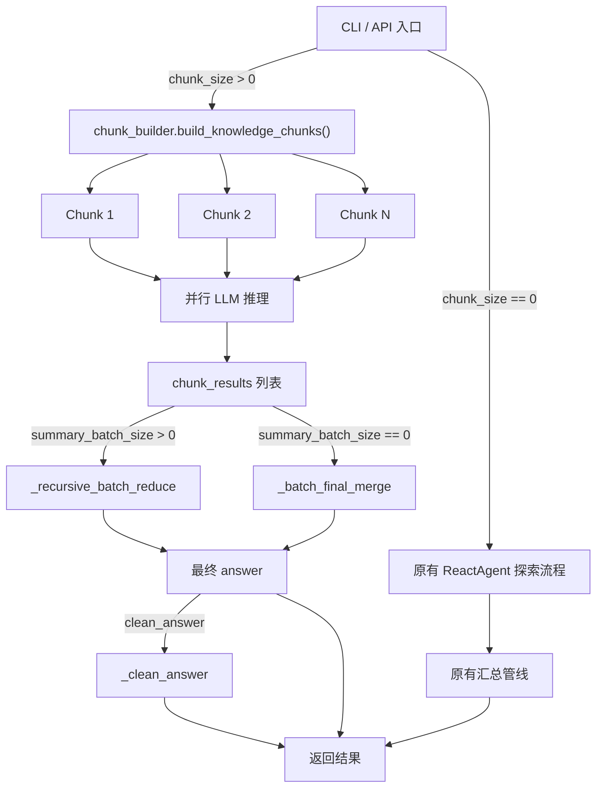

# V1 Chunk-Based Reasoning Mode

## 现状分析

当前 v1 的推理流程是：
1. **ReactAgent 探索阶段** -- 从知识树根出发，LLM 决定导航方向（ROOT_EXPLORE -> 并行子智能体递归 EXPLORE/STOP），每次读取目录下的 `knowledge.md`，LLM 评估相关性/收集证据
2. **汇总阶段** -- `AgentGraph` 将探索结果 flatten，按标准/召回模式做 `_final_summary` 或 `_batched_summary`

你的新设计是一种 **确定性分块 + 并行推理** 模式，核心区别在于：
- **探索阶段不依赖 LLM 导航**，而是程序化遍历整棵知识目录树
- **按 `--chunk-size` 将知识拼接成定长块**，每块保留完整的层级上下文
- **每个 chunk 一个子智能体并行推理**，之后进入已有的分批汇总流程

## 知识目录结构

```
test_knowhow_result_xxx/
├── knowledge.md                   (根：文档概览 + 子目录概览)
├── 0_文档标题/knowledge.md         (可选第0章)
├── 1_会计处理/
│   ├── knowledge.md               (一级章节)
│   ├── 1.1_xxx/knowledge.md       (二级)
│   │   └── 1.1.1_xxx/knowledge.md (三级)
│   └── 1.2_xxx/knowledge.md
├── 2_涉税处理/
│   └── ...
└── 5_附件（农产品范围）/
    └── 5.1_植物类/
        └── 5.1.3_烟叶/
            └── 5.1.3.1_xxx/knowledge.md (最深4层)
```

每个目录的 `knowledge.md` 包含：`## 当前路径`、`## 项目条款名称`、`## 本章节内容`、`## 子目录概览`。

## 新增/修改文件清单

### 1. 新增 `reasoner/v1/chunk_builder.py` -- 知识分块器

核心逻辑：

```python
@dataclass
class KnowledgeChunk:
    index: int              # chunk 序号
    content: str            # 拼接后的知识文本
    heading_paths: list     # 包含的目录层级路径列表
    directories: list[str]  # 包含的目录路径列表

def build_knowledge_chunks(
    knowledge_root: str,
    chunk_size: int = 5000,
) -> list[KnowledgeChunk]:
    """
    按目录树顺序，深度优先遍历知识目录，
    将 knowledge.md 内容按 chunk_size 切分为多个知识块。
    """
```

**分块算法**：

1. 深度优先遍历知识目录树，按编号排序（利用已有的 `_list_subdirs` 排序逻辑）
2. 对每个节点，提取 `## 本章节内容` 部分（跳过 `## 子目录概览`、`## 当前路径`等元数据），并附带层级标签如 `【1_会计处理 > 1.1_xxx > 1.1.1_xxx】`
3. 尝试将当前节点内容追加到当前 chunk：
   - 若追加后 <= chunk_size：追加，继续
   - 若追加后 > chunk_size 且当前 chunk 非空：**另起一个新 chunk**
   - 新 chunk 的开头自动补上 **上游层级目录标签链**（仅标签，不含上级内容），保证语义路径完整
4. 特殊规则：遇到**一级目录的起始位置**时，即使当前 chunk 未满，也强制另起新 chunk（保证一级章节边界清晰）

**分块效果示例**：

```
Chunk 1 (4800字):
【1_会计处理】
(1_会计处理 knowledge.md 正文)
【1_会计处理 > 1.1_xxx】
(1.1_xxx knowledge.md 正文)
【1_会计处理 > 1.1_xxx > 1.1.1_xxx】
(1.1.1_xxx knowledge.md 正文)

Chunk 2 (4600字):
【1_会计处理 > 1.2_xxx】    <-- 上游路径标签，内容不重复
(1.2_xxx knowledge.md 正文)
【1_会计处理 > 1.2_xxx > 1.2.1_xxx】
(1.2.1_xxx knowledge.md 正文)
...
```

### 2. 修改 [reasoner/v1/agent_graph.py](reasoner/v1/agent_graph.py) -- 新增 chunk 模式分支

在 `AgentGraph` 中新增参数和方法：

- `__init__` 新增 `chunk_size: int = 0` 参数（0 表示不启用 chunk 模式，使用原有 ReactAgent 模式）
- 新增 `_chunk_pipeline()` 方法：
  1. 调用 `build_knowledge_chunks(knowledge_root, chunk_size)` 获取知识块列表
  2. 为每个 chunk 并行启动一个 LLM 推理调用（使用新的 `CHUNK_REASONING_PROMPT`）
  3. 收集所有 chunk 的推理结果
  4. 进入已有的 `_batched_summary()` / `_batch_final_merge()` 汇总流程（与 `--summary-batch-size` 兼容）
- `run()` 方法中增加分支：`chunk_size > 0` 走 `_chunk_pipeline()`，否则走原有 ReactAgent 流程

```python
def run(self) -> dict:
    if self.chunk_size > 0:
        answer = self._chunk_pipeline()
    elif self.retrieval_mode:
        # 原有流程...
        answer = self._retrieval_pipeline()
    else:
        answer = self._standard_pipeline()
    ...
```

`_chunk_pipeline()` 核心流程：

```python
def _chunk_pipeline(self) -> str:
    chunks = build_knowledge_chunks(self.knowledge_root, self.chunk_size)
    
    # 并行推理：每个 chunk 一个子智能体
    chunk_results = []
    with ThreadPoolExecutor(max_workers=min(len(chunks), 10)) as executor:
        futures = {
            executor.submit(self._reason_on_chunk, chunk): chunk
            for chunk in chunks
        }
        for future in as_completed(futures):
            chunk_results.append(future.result())
    
    # 进入分批汇总（复用已有的 batched summary 逻辑）
    if self.summary_batch_size > 0:
        return self._recursive_batch_reduce(chunk_results, layer=1)
    else:
        return self._batch_final_merge(chunk_results, layer=1)
```

### 3. 修改 [reasoner/v1/prompts.py](reasoner/v1/prompts.py) -- 新增 chunk 推理 Prompt

新增 `CHUNK_REASONING_PROMPT`：

```python
CHUNK_REASONING_PROMPT = """\
你是一个知识分析智能体。你将收到一段知识内容（来自知识体系的某些章节），请基于该知识内容，
针对用户问题提取所有可以提供的有效信息。

## 用户问题
{question}

## 知识内容（第 {chunk_index}/{total_chunks} 块）
{chunk_content}

---

请基于以上知识内容，提取与用户问题相关的所有有效信息。要求：
1. 100%直接摘录知识原文，不做归纳改写
2. 如果本块知识与用户问题无关，明确说明"本块知识未包含与问题相关的信息"
3. 保留知识的层级上下文信息（如章节编号和标题）
4. 不要引入知识内容中未提及的术语或概念

请直接输出你的分析结果（纯文本，不需要 JSON 格式）。
"""
```

### 4. 修改 [main.py](main.py) -- 新增 `--chunk-size` 参数

在 `reason` 子命令中新增：

```python
reason_parser.add_argument(
    "--chunk-size", type=int, default=0,
    help="启用知识分块模式：按指定字符数上限对知识目录树进行程序化分块，"
         "每个块并行推理后汇总。默认 0 表示不启用（使用原有 ReactAgent 探索模式）"
)
```

并在 `cmd_reason` 中将 `args.chunk_size` 传递给 `run_single_question` / `run_reasoning`。

### 5. 修改 [reasoner/v1/engine.py](reasoner/v1/engine.py) -- 透传 `chunk_size` 参数

在 `_process_single_question`、`run_single_question`、`run_reasoning` 等函数签名和 `AgentGraph(...)` 构造中增加 `chunk_size` 参数透传。

### 6. 修改 [app.py](app.py) -- 可选透传

在 HTTP 请求体 `ReasonRequest` 中可选增加 `chunkSize` 字段（默认 0），透传给 `AgentGraph`。

## 数据流总览



## 关键设计决策

- **chunk 模式与现有模式互斥**：`chunk_size > 0` 时完全跳过 ReactAgent 探索，不创建 `ExploredRegistry` 等共享状态
- **一级目录边界强制分块**：即使当前 chunk 未满，遇到新的一级目录也另起新 chunk，保证知识语义边界清晰
- **上游路径补全**：每个非一级目录起始的 chunk，头部都带上完整的上游层级标签（如 `【1_会计处理 > 1.2_xxx】`），不带上级内容
- **复用汇总管线**：chunk 推理结果直接复用 `_batched_summary` / `_batch_final_merge` / `_clean_answer` 等已有逻辑
- **`relevant_chapters` 提取**：从每个 chunk 的 `directories` 列表中提取章节号，与现有逻辑兼容
