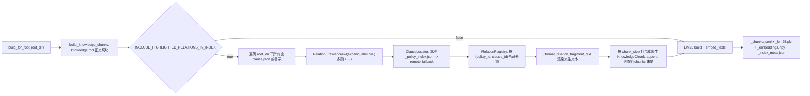

## 背景与定位

当前 inference 离线索引的语料**只来自**各章节目录的 `knowledge.md` 正文（[`reasoner/v3/chunk_builder.py`](reasoner/v3/chunk_builder.py) 的 `build_knowledge_chunks`），完全没有把 `clause.json.references[].highlightedContent` 这类"父章节高亮词 → 外部条款"的关联关系喂进 BM25 / embedding 语料。reasoner 在线模式有 [`HighlightPrecheck`](reasoner/v3/highlight_precheck.py) + [`RelationCrawler`](reasoner/v3/relation_crawler.py) 这条独立通路，但 [`inference/retrieval/hybrid.py`](inference/retrieval/hybrid.py) 完全不读 `RelationFragment`，所以"煮蔬菜免税 → 《蔬菜主要品种目录》具体名单"这类跨条款命中在 inference 模式下漏召。

方案核心：**复用** reasoner 已有的多跳定位/抓取链路，把 `RelationFragment` 在**建索引阶段**就静态烘进 chunks，下游 BM25 / embedding / hybrid_search / react_loop 一律不改。

## 关键设计决策（已与用户确认）

- **跳深**：多跳 BFS，复用 `RelationCrawler` 默认 `max_depth=5` / `max_nodes=50`。
- **远程兜底**：允许，本地索引未命中时走 `ClauseLocator._try_remote`，超时/失败降级跳过单条，不影响整体建索引。
- **不调 LLM**：`RelationCrawler(expand_all=True)`（默认值）会跳过所有 `RELATION_RELEVANCE_PROMPT` 判定，定位成功即入 fragment，纯静态展开。
- **覆盖三条入口**：方案必须同时正确处理 `kh_update`（强制重建）、reason/inference 临时获取的"新抽 policy"分支、以及"命中本地 policy 但跨 policy 派生过期"的级联场景。

## 三条入口的现状与方案对齐

| 入口 | 当前知识获取 | 当前索引重建 | 派生 chunks 是否覆盖 |
|---|---|---|---|
| `POST /api/kh/update` [`app.py:1091`](app.py) | `_create_knowledge` → `extract_from_api` 全量新版 | `force_rebuild=True` | 走新版 `build_for_root`，自带派生 chunks |
| `POST /api/reason/submit` executor [`app.py:1173`](app.py) | `_get_or_extract_knowledge`（内存/磁盘命中 → 直接复用；否则 fallback `extract_from_api`） | `force_rebuild=False`，缺三件套或 meta 过期才建 | 新抽分支：缺三件套必重建 ✅；命中本地分支：靠 schema_version + stale 标记触发 |
| `POST /api/inference/stream` [`app.py:1840`](app.py) | 同上 | 同上 | 同上 |

## 跨 policy 级联缺口（必须修）

由 [`extractor/builder.py:147`](extractor/builder.py) `extract_from_api` 行为确认：抽取 policy A 时**只落盘 A 自己的目录**，引用图中目标 policy B 仅在 A 的 `clause.json.references` 里以 `(policy_id, clause_id)` 记录，**不会**为 B 自动建独立的 knowledge_root。

由此衍生的场景：

- **T0**：kh_update A。建 A 索引时 B 不在本地 `_policy_index.json` → `ClauseLocator._try_local` 失败 → `_try_remote` 拉到 B 的 markdown → 派生 chunks**冻结**到 A 的 `_chunks.jsonl`。
- **T1**：kh_update B。B 自己的索引建好，**A 的索引无人重建** → A 的派生 chunks 仍停在 T0 远程版本；如 B 内容被修订或 HTML→md 渲染规则有差异，A 的检索会偏。
- 同样适用于"临时获取"路径：今天临时上线 B，明天再 inference 查 A，A 仍是旧索引。

reasoner 在线模式没这问题（每次实时跑 `RelationCrawler`），但 inference 是离线索引，必须显式触发级联。

### 反向追踪表 + stale 标记

每次 `build_for_root` 写完三件套时，**同目录额外落一份** `_relation_targets.json`：

```json
{
  "schema_version": 2,
  "targets": [
    {"policy_id": "KH1494363304054435840_20260422154653", "clause_id": "cd6dca..."}
  ]
}
```

这是"本 root 的派生 chunks 依赖了哪些外部 (policy_id, clause_id)"的反向索引。同时 `_index_meta.json` 增加 `stale: false` 字段。

### kh_update 的级联触发

`kh_update(B)` 在 `_ensure_inference_artifacts(B_dir, force_rebuild=True)` 完成后，**追加一段级联**：

1. 扫 `page_knowledge/*/` 下所有 `_relation_targets.json`，找出 `targets` 中出现过 `B.policy_id` 的 root 集合 `{A_1, A_2, …}`。
2. 对每个 `A_i` 写入 `_index_meta.json.stale=true`（仅写标记，不立即建库）。
3. **fire-and-forget**：`asyncio.create_task` 异步逐个触发 `_ensure_inference_artifacts(A_i_dir, policy_id=A_i_policy, force_rebuild=True)`，**不阻塞** kh_update 的 HTTP 响应。
4. 异步重建复用现有的 `_INDEX_BUILD_LOCKS[policy_id]`，并发安全；失败仅记 WARN，stale 标记保留供下一次兜底捡漏。

### 兜底（临时获取路径）

在 `_inference_artifacts_missing` 升级为 `_inference_artifacts_stale`，判定为 stale 的口径扩展成"任一条成立"：

- 三件套有文件缺失（兼容旧逻辑）；
- 缺少 `_index_meta.json` 或 `schema_version < INDEX_SCHEMA_VERSION`；
- `_index_meta.json.stale == true`（被 kh_update 级联标记的 root，若异步重建因进程重启等原因没跑完，下次 reason/inference 来时会兜底重建）。

这一条统一覆盖了：
- 历史 policy 第一次升级（schema 升级）；
- 跨 policy 内容更新后的级联刷新；
- 异步级联因进程崩溃丢失的容灾兜底。

## 数据通路对照



## 派生 chunk 的文本骨架（来自 `_format_relation_fragment_text`，无需新写）

```
【来自父章节 · 知识名 > 2_涉税处理 > 2.1_增值税 > … > 流通环节销售蔬菜（批发零售环节）】
【命中关键词 · 蔬菜主要品种目录】
【关联条款位置 · 知识名 > 5_附件 > … > 蔬菜主要品种目录】
> 上层关联性判定: 离线索引构建：静态展开所有外链高亮，无在线 LLM 判定。

**蔬菜主要品种目录 的关联知识细节如下：**
（目标条款的完整 markdown 正文，含所有品种列表）
```

这种文本对 BM25 友好（关键词同时出现在头部坐标行 + 正文标题 + 正文），对 embedding 友好（短摘要 + 长正文）。

## 改动清单

### 1. [`inference/config.py`](inference/config.py) — 新增 4 个开关

```python
INCLUDE_HIGHLIGHTED_RELATIONS_IN_INDEX: bool = True
HIGHLIGHT_INDEX_MAX_DEPTH: int = 5
HIGHLIGHT_INDEX_MAX_NODES: int = 50
HIGHLIGHT_INDEX_ALLOW_REMOTE: bool = True
HIGHLIGHT_INDEX_REMOTE_TIMEOUT: float = 5.0
INDEX_SCHEMA_VERSION: int = 2  # 旧索引失效用
```

### 2. [`inference/retrieval/indexer.py`](inference/retrieval/indexer.py) — 核心新增

在现有 `build_for_root` 内、`build_knowledge_chunks` 之后、写 `_chunks.jsonl` 之前，新增辅助函数 `_collect_relation_chunks`：

- 用 `page_knowledge_dir = os.path.dirname(root_dir)` + `_policy_index.json` 初始化一个 `ClauseLocator`；远程参数由 `HIGHLIGHT_INDEX_ALLOW_REMOTE` 控制（不允许时把 `api_url=""` 即可让 `_try_remote` 早退）。
- 创建一个共享 `RelationRegistry` 和 `ThreadPoolExecutor`，构造 `RelationCrawler(question="", registry=…, locator=…, executor=…, expand_all=True, max_depth=…, max_nodes=…)`。`question=""` 不影响 expand_all 路径。
- `os.walk(root_dir)` 找出所有含 `clause.json` 的目录，对每个目录调 `crawler.crawl(source_chunk_index=-1, source_dir=<dir>, parent_assessment="离线索引构建：静态展开高亮外链")`。整段包 try/except，单条 crawl 失败只记 WARN、不影响整体。
- 抓完后 `relations = registry.get_all()`。按 `chunk_size` 顺序打包派生 chunks：
  - 直接用 [`reasoner/v3/chunk_builder._format_relation_fragment_text`](reasoner/v3/chunk_builder.py)（本地导入并加注释说明跨模块耦合）渲染单 fragment 文本。
  - 按 `chunk_size` 贪心合并，单 fragment 超大就独立成 chunk（与 `split_relations_into_chunks` 同语义）。
  - 派生 chunk 的 `index` 从 `len(original_chunks)` 起递增；`directories` 填 `[fragment.target_dir]`（命中本地时）或 `[fragment.parent_dir]`（远程兜底时），让 preview 回填能用；`heading_paths` 写 `fragment.heading_path` 的列表。
- 同时收集 `relation_targets = [{"policy_id": fr.policy_id, "clause_id": fr.clause_id} for fr in relations]`，供级联反向追踪表使用。
- 将派生 chunks `extend` 进 `chunks` 列表后，原有的写 `_chunks.jsonl`、`bm25_mod.build([c.content for c in chunks])`、`embed_texts([c.content for c in chunks])` **完全不动**。
- 末尾**额外**落两份小 JSON：
  - `_index_meta.json`：`{"schema_version": INDEX_SCHEMA_VERSION, "with_relations": True, "n_original": N1, "n_derived": N2, "stale": false, "built_at": <ts>}`
  - `_relation_targets.json`：`{"schema_version": INDEX_SCHEMA_VERSION, "targets": relation_targets}`（用于跨 policy 级联反查）

### 3. [`app.py`](app.py) `_ensure_inference_artifacts` — stale 判定 + 级联触发

3.1 **把"缺失判定"升级为"过期判定"** `_inference_artifacts_stale(knowledge_dir)`，任一成立即触发重建：

- 三件套有文件缺失（兼容旧逻辑）；
- 缺 `_index_meta.json` 或 `schema_version < INDEX_SCHEMA_VERSION`；
- `_index_meta.json.stale == True`。

`_ensure_inference_artifacts` 的入口判断从 `_inference_artifacts_missing` 换成 `_inference_artifacts_stale`。这一条同时承担了"历史 policy 首次升级"、"被级联标记的 stale root 兜底重建"、"跨 policy 派生过期"三种 case。

3.2 **新增 `_cascade_dependent_rebuilds(updated_policy_id)`**：

- 扫 `page_knowledge/*/_relation_targets.json`，找出 `targets` 中出现过 `updated_policy_id` 的 root 集合 `{A_i}`。
- 对每个 `A_i`：先写入 `_index_meta.json.stale=true`（轻量标记，立即生效）；再用 `asyncio.create_task` fire-and-forget 触发 `_ensure_inference_artifacts(A_i_dir, policy_id=A_i_policy, force_rebuild=True)`。
- 复用现有 `_INDEX_BUILD_LOCKS[policy_id]`，与正在跑的兜底重建天然互斥。
- 异步任务失败只记 WARN，`stale=true` 标记保留 → 下一次该 policy 走 reason/inference 时由 `_inference_artifacts_stale` 兜底重建。

3.3 **在 `kh_update` 调用点接入**：

`kh_update` 完成 `_ensure_inference_artifacts(force_rebuild=True)` 后调一次 `_cascade_dependent_rebuilds(policy_id)`，不阻塞响应：

```python
await _ensure_inference_artifacts(knowledge_dir, policy_id=policy_id, force_rebuild=True)
asyncio.create_task(_cascade_dependent_rebuilds(policy_id))
```

3.4 **临时获取路径**（reason/inference）的两个子分支均已被 3.1 的 stale 判定自动覆盖：

- 新抽 policy：三件套必然缺失 → 触发重建（带派生 chunks）✅
- 命中本地 policy：若曾被 `_cascade_dependent_rebuilds` 标记 stale 但后台重建未完成（如重启）→ 此次请求兜底重建 ✅

### 4. [`inference/scripts/build_indices.py`](inference/scripts/build_indices.py) — CLI 透传（可选）

加 `--no-relations` / `--max-depth N` / `--no-remote` 参数，便于线下调试与回归对照。`build_for_root` 接收同名 kwargs（默认从 config 读）。

### 5. [`inference/retrieval/hybrid.py`](inference/retrieval/hybrid.py) — 不动

`hybrid_search` 只读 `c.content`，派生 chunks 与原始 chunks 在 BM25 / embedding 层是同构的，RRF 融合天然支持。

## 边界与风险

- **建索引耗时上升**：多跳 + 远程会显著拉长 `build_for_root`。`ClauseLocator._cache` 已自带 `(policy_id, clause_id)` memo，跨 source_dir 共享同一 locator 实例即可（本方案已这样做）。远程默认 `timeout=5s`，单条 fail 不阻塞。
- **跨知识包定位**：`_policy_index.json` 记录的是 `page_knowledge_dir` 下所有 policy；只要目标 policy 已抽取过就能本地命中，未抽取走远程。这与 reasoner 在线一致，无新增风险。
- **派生 chunk 与 preview 章节回填**：preview 现有逻辑读 `chunk.directories` 反查目录树。派生 chunk 的 `directories = [target_dir]` 在本地命中时是合法路径；远程兜底节点 `target_dir=""`，preview 看到空 list 会自动跳过，不会污染回填。
- **去重粒度**：`RelationRegistry` 按 `(policy_id, clause_id)` 全局去重，同一目标条款被多个父章节高亮命中时合并到 `highlighted_aliases`，渲染头部的 `【命中关键词 · A | B | C】` 由 `build_highlighted_label` 处理。BM25 看到所有别名都在 chunk 头部，召回友好。
- **级联风暴**：若同一份基础 policy（如某万能附件）被几十个 policy 引用，一次 kh_update 会触发几十个 root 重建。已在 `_INDEX_BUILD_LOCKS` 串行 + asyncio.create_task fire-and-forget 异步，不阻塞接口；若需要进一步限流可后续在 `_cascade_dependent_rebuilds` 内引入 `asyncio.Semaphore`。
- **级联进度可观测性**：`_index_meta.json.stale` 字段直接反映"该 root 已被标记需要刷新但尚未跑完"，运维可一眼看出哪些 root 滞后。重建成功后写回 `stale=false`，失败保留。
- **关闭开关**：`INCLUDE_HIGHLIGHTED_RELATIONS_IN_INDEX=False` 时全链路退化为旧行为（不写 `_relation_targets.json`、不级联），便于线上灰度回滚。
- **不影响 reasoner 在线**：reasoner 自己仍走 `HighlightPrecheck` + `RelationCrawler` 实时跑，不复用离线索引这套 chunk。两条路解耦。