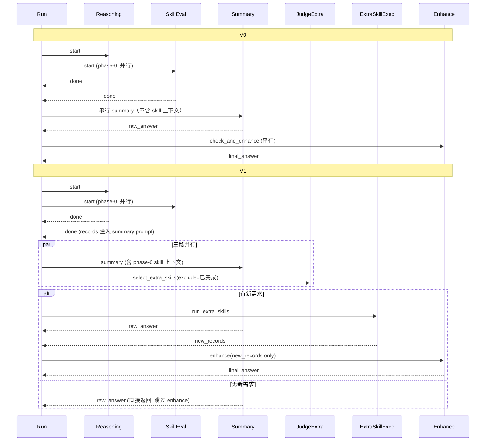
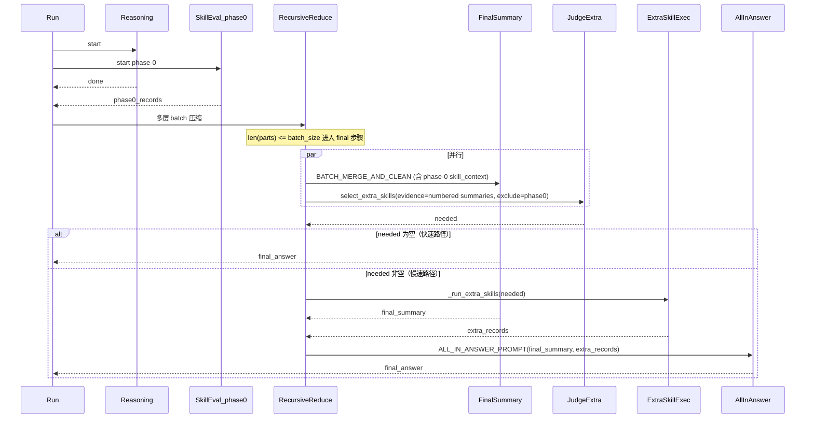
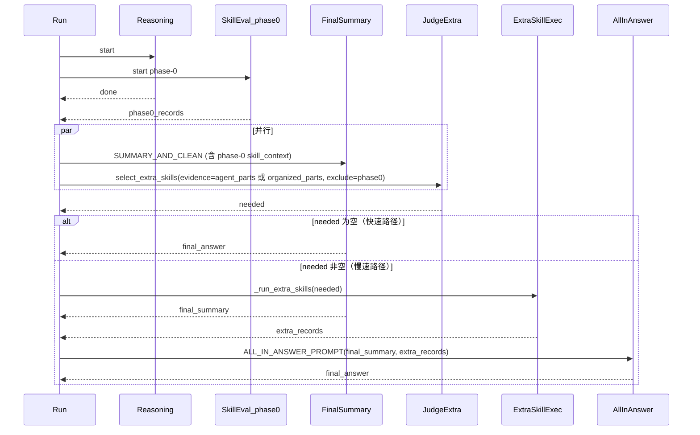

# Skill 触发时机对比（V0 / V1 现状）

> 记录 reasoner 的两个版本中"使用 skill 的检查 / 触发"分别在何时被调用。
> 源码位置：[reasoner/v0/agent_graph.py](v0/agent_graph.py)、[reasoner/v1/agent_graph.py](v1/agent_graph.py)、
> [skills/evaluator.py](../skills/evaluator.py)、[skills/double_check.py](../skills/double_check.py)。

## V0：两段式（前置评估 → 串行 double-check）

| 阶段 | 触发时机 | 调用栈 / 作用 |
| --- | --- | --- |
| Phase-0 预评估 | `run()` 开始时，与"根 agent 推理"通过 `ThreadPoolExecutor(max_workers=2)` **并行**起跑 | `_run_skill_evaluation` → `evaluate_and_run`（Step1 选 skill → Step2 出参 → 沙箱执行） |
| Double-check | 推理 + summary 全部产出 `answer` **之后**，串行做一次增强 | `_run_double_check` → `check_and_enhance` |

关键代码：

```python
# reasoner/v0/agent_graph.py L132-L147
if self.enable_skills:
    with ThreadPoolExecutor(max_workers=2) as executor:
        skill_future = executor.submit(self._run_skill_evaluation)
        reasoning_future = executor.submit(self._run_root_agent_and_flatten)
        reasoning_future.result()
        skill_future.result()
else:
    self._run_root_agent_and_flatten()

if self.retrieval_mode:
    answer = self._retrieval_pipeline()
else:
    answer = self._standard_pipeline()

if self.enable_skills:
    answer = self._run_double_check(answer)
```

V0 的 double-check 内部逻辑（`skills/double_check.py`）也是**条件式**触发：

- 如果 phase-0 已经跑出过 skill 结果 → 直接 `_enhance_with_skill_results`（一次 LLM 增强）
- 如果 phase-0 没跑过 → 让 LLM `_judge_need_skill` 判断是否需要补；需要才再补跑一次 `evaluate_and_run` 然后 enhance

也就是说 V0 的 skill 检查**只有 2 个时点**：

1. 推理开始前并行起跑 phase-0；
2. summary 出 answer 后串行做 double-check。

Phase-0 的结果**不会**喂给 summary，只在最后一步用 enhance 注入。

## V1：三路并行 + skill 上下文前置注入到 summary

V1 增加了一个关键变化：**phase-0 的 skill 结果会被打包成"权威事实段"提前注入 summary 的 prompt**，
并且 double-check 阶段被改成"summary || extra-skill 判定 || 按需执行"的**三路并行**编排。

标准模式入口 `run()` 关键片段：

```python
# reasoner/v1/agent_graph.py L306-L329
if self.enable_skills:
    with ThreadPoolExecutor(max_workers=2) as executor:
        skill_future = executor.submit(self._run_skill_evaluation)
        reasoning_future = executor.submit(self._run_root_agent_and_flatten)
        reasoning_future.result()
        skill_future.result()
else:
    self._run_root_agent_and_flatten()

if self.enable_skills and self.skill_registry:
    done_records_snapshot = self.skill_registry.get_all()
else:
    done_records_snapshot = []
summary_skill_context = self._build_skill_context_for_summary(done_records_snapshot)

def _summary_callable():
    if self.retrieval_mode:
        return self._retrieval_pipeline(skill_context=summary_skill_context)
    return self._standard_pipeline(skill_context=summary_skill_context)

answer = self._orchestrate_summary_with_double_check(_summary_callable)
```

Chunk 模式 `_run_chunk_mode()` 的结构完全一致，只是把 `_run_root_agent_and_flatten` 换成 `_chunk_reason_phase`
（参见 `reasoner/v1/agent_graph.py` L379-L397）。

三路并行编排（关键差异点）：

```python
# reasoner/v1/agent_graph.py L253-L294
if not self.enable_skills or not self.skill_registry:
    return summary_callable()

done_records_snapshot = self.skill_registry.get_all()
done_skill_names = {r.skill_name for r in done_records_snapshot}

with ThreadPoolExecutor(max_workers=3) as executor:
    summary_future = executor.submit(summary_callable)
    judge_future = executor.submit(self._judge_extra_skills, done_skill_names)

    try:
        extra_needed = judge_future.result()
    except Exception as e:
        ...
        extra_needed = []

    extra_future = (
        executor.submit(self._run_extra_skills, extra_needed)
        if extra_needed else None
    )

    raw_answer = summary_future.result()

    if extra_future is None:
        # 无新需求 → 省掉 enhance 调用，直接采用 summary 输出
        return raw_answer

    new_records = extra_future.result()

return self._enhance_with_new_records(raw_answer, new_records)
```

V1 中"使用 skill 的检查逻辑"实际有 **3 个触发时点**：

1. **Phase-0 预评估**：`run()` / `_run_chunk_mode()` 一开始，与根 agent 推理 / chunk 推理并行
   （`_run_skill_evaluation` → `evaluate_and_run` 完整 Step1+Step2+exec）。
2. **Phase-1 二次判定（与 summary 并行）**：summary 启动的同一时刻，
   `_judge_extra_skills` → `select_extra_skills`（`skills/evaluator.py` L200）让 LLM 仅基于 `question`
   决定"还差哪些 skill"，并把 phase-0 已完成的从可选项里 `exclude` 掉以避免重复。
3. **Phase-2 按需补跑 + enhance**：只有 phase-1 判定有缺口时才会触发 `_run_extra_skills`
   （跑 Step2+exec），并在 summary 完成后用 `_enhance_with_new_records` 做一次"仅基于新增 records"的 enhance；
   若 phase-1 判定无新需求，会**直接跳过 enhance**，省掉一次 LLM 调用。

另外，V1 保留了 `_run_double_check`（`reasoner/v1/agent_graph.py` L123-L140）作为兼容入口，
但默认主路径**不再走它**。

## 时序对比（泳道图）



## 核心差异速查

- **触发点数量**：V0 = 2（phase-0 + 串行 double-check）；V1 = 3（phase-0 + 并行 judge + 按需 extra-exec/enhance）。
- **phase-0 结果是否前置喂给 summary**：V0 否；V1 是
  （`_build_skill_context_for_summary` → `_append_skill_context_to_prompt` 插到 `---` 之前）。
- **double-check 的判定依据**：V0 基于 `question + raw_answer`（`_judge_need_skill`）；
  V1 仅基于 `question` 并 `exclude` 已完成 skill（`select_extra_skills`）。
- **是否能跳过 enhance**：V0 只要 phase-0 跑过就**一定**会走一次 enhance LLM；
  V1 在判定无新需求时**直接返回 summary 原文**，省一次 LLM。
- **执行编排**：V0 是"并行 phase-0 → 串行 summary → 串行 enhance"；
  V1 是"并行 phase-0 → 三路并行 (summary || judge || extra-exec) → 按需 enhance"。
- **enhance 输入范围**：V0 把 `registry` 里**所有** records 再 load 一遍；
  V1 只 load **新增** records（老的已经在 summary 里）。

## V1 → V1.1 重构方案

V1.1 的核心改动：**把 judge 的触发时机从 "summary 启动同步" 推迟到 "final merge 启动同步"，
并喂给 judge 一段浓缩 evidence**；final summary 步骤继续走带清洗的现有逻辑，只有当 judge 真正
判定需要新 skill 时才阻塞等待 extra-skill 完成，并通过新引入的 **all-in-answer** 步骤把
新 records 拼接到已清洗的 final summary 上。

phase-0 的预评估时机不变；phase-0 records 也仍然按 V1 原有方式被前置注入到 final summary
prompt（`_build_skill_context_for_summary` → `_append_skill_context_to_prompt` 保留）。

### batch_size > 0（标准 / 召回 / chunk 三种模式共用入口 = `_batch_final_merge` / `_retrieval_batch_final_merge`）



### batch_size = 0（`_final_summary` / `_retrieval_final_summary`）



### V1 → V1.1 触发点对比

| 维度 | V1 | V1.1 |
| --- | --- | --- |
| Phase-0 时机 | run() 开头并行 | 不变 |
| Judge 时机 | summary 启动**同步**并行 | **final merge 启动同步**并行（位置下沉到 `_batch_final_merge` 等内部） |
| Judge evidence | 仅 question + 已完成 skill | question + 已完成 skill + **被压缩的 numbered summaries / agent_parts / organized_parts** |
| Phase-0 records 注入 | 前置注入到 final summary prompt | **不变**，仍前置注入 |
| 快速路径（无新 skill 需求） | 直接采用 summary 输出 | **不变**，直接采用 final summary 输出 |
| 慢速路径合成 | `_enhance_with_new_records` → 旧 ENHANCE prompt | 新 `_all_in_answer` → `ALL_IN_ANSWER_PROMPT`（强调"在已清洗草稿上做最小修订，保持简洁风格"） |
| 编排外壳 | `_orchestrate_summary_with_double_check` 包住 summary_callable | **删除**该外壳，judge 调度全部下沉到 final 步骤；`run()` / `_run_chunk_mode()` 直接调 pipeline |
| `select_extra_skills` 接口 | `(question, exclude, vendor, model)` | 新增 `evidence: str | None = None`，向后兼容 |

### 实现关键点（代码索引）

- 编排骨架：[reasoner/v1/agent_graph.py](v1/agent_graph.py) 中新增 `_finalize_with_double_check`、`_all_in_answer`，并改造 4 个 final 方法（`_final_summary` / `_retrieval_final_summary` / `_batch_final_merge` / `_retrieval_batch_final_merge`）
- judge 接口：[skills/evaluator.py](../skills/evaluator.py) `select_extra_skills` 新增 `evidence` 参数，prompt 末尾追加"已知中间证据"段
- 新 prompt：[reasoner/v1/prompts.py](v1/prompts.py) 新增 `ALL_IN_ANSWER_PROMPT`
- enable_skills=False 路径：`_finalize_with_double_check` 在最前判断后直接 `return final_summary_callable()`，与 V1 行为完全一致
